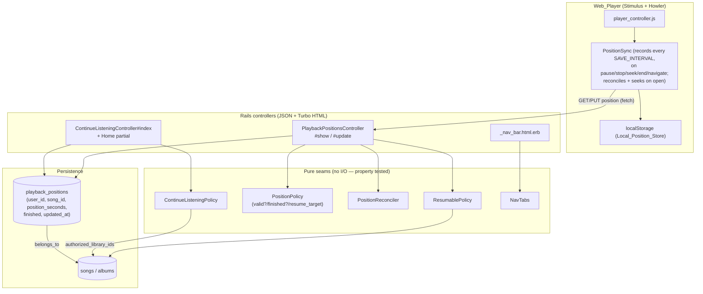

# Design Document

## Overview

This feature adds two user-facing capabilities to Black Candy Store, both built on existing platform seams rather than new subsystems:

1. **Playback-position resume.** A per-User, per-Song elapsed-position store, a rule for which Songs are eligible (Resumable_Tracks), a client-agnostic API to save and read a position, a server-authoritative "finished" state, a Web_Player that records and auto-resumes position, and a "Continue listening" surface on Home. Position is written to `localStorage` immediately for responsiveness and synchronized to the Server as the source of truth so resume works across a User's devices.

2. **Navigation entry points.** Top-level Global_Navigation tabs for the already-implemented Radio Stations, Party Sessions, and Co-listen Sessions sections, with active-tab state derived from the controller currently handling the request.

The design isolates every correctness-sensitive decision into a small set of **pure seams** — Ruby POROs/modules with no I/O — so they can be validated with property-based tests, while the persistence, HTTP, and browser layers stay thin and are covered by integration/system tests.

### Reused platform seams

| Seam | Role in this feature | Source |
|------|----------------------|--------|
| `ContentClassifier` / `Album#audiobook?` | Determines whether a Song's Album is an Audiobook (Req 1.1, 1.4) | `app/models/content_classifier.rb`, `app/models/album.rb` |
| `Song#duration` (float column, seconds) | Feeds the Long_Track_Threshold and validation/finished math (Req 1.2, 2.6, 5.1) | `db/schema.rb` `songs.duration` |
| `Authentication` concern (`Current.user`, cookie + Bearer) | Authenticates every position request (Req 7.2, 7.6) | `app/controllers/concerns/authentication.rb` |
| `User#authorized_library_ids` / `LibraryAccess` | Bounds the Continue_Listening_List to accessible libraries (Req 4.4) | `app/models/user.rb`, `app/controllers/concerns/library_access.rb` |
| `ExceptionRescue` (`render_json_error`, `BlackCandy::Forbidden` / `::Unauthorized`, `RecordInvalid`) | Uniform JSON + HTML error responses (Req 2.6, 2.7, 7.2, 7.4, 7.7) | `app/controllers/concerns/exception_rescue.rb` |
| `song_json_builder` (Jbuilder) | Carries `resumable` + `resume_position` into the player playlist (Req 3, 6) | `app/helpers/song_helper.rb` |
| Stimulus `player_controller` + `Player` (Howler, `currentTime`, `player:*` events, `localStorage`) | Records/resumes position in the browser (Req 2, 3, 6) | `app/javascript/controllers/player_controller.js`, `app/javascript/player.js` |
| `_nav_bar.html.erb` + `current_controller` local (`controller_name`) | Renders the added tabs and active state (Req 9) | `app/views/shared/_nav_bar.html.erb`, `app/views/layouts/application.html.erb` |

### Fixed constants (from requirements)

| Name | Value | Meaning |
|------|-------|---------|
| `LONG_TRACK_THRESHOLD` | `1200` s | Duration at/above which any Song is resumable (Req 1.2, A2) |
| `MINIMUM_RESUME_POSITION` | `10` s | Smallest position treated as a meaningful resume point (Req 3.1, 3.3, 4.1) |
| `FINISHED_THRESHOLD` | `30` s remaining | Remaining time at/below which a Song is finished (Req 3.1, 5.1) |
| `SAVE_INTERVAL` | `10` s | Max elapsed play time between Server saves (Req 2.1, 2.2) |

These live as constants on the `PlaybackPosition` model and are surfaced to the browser through a small data attribute block so JS and Ruby never drift.

## Requirements Coverage Map

| Requirement | Acceptance criteria | Where satisfied |
|-------------|---------------------|-----------------|
| 1 Identify resumable content | 1.1–1.4 | `ResumablePolicy.resumable?` (pure), `Song#resumable?`; classification via `Album#audiobook?` |
| 2 Capture & persist position | 2.1–2.3 | Web_Player `PositionSync` (interval + event saves) |
| | 2.4, 2.5 | `PlaybackPositionsController#update` upsert on (user, song) |
| | 2.6 | `PositionPolicy.valid_position?` + model validation → `RecordInvalid` (422) |
| | 2.7 | `ResumablePolicy` guard in controller/model → `RecordInvalid` (422) |
| | 2.8 | Web_Player best-effort save (localStorage retained on failure) |
| 3 Resume on reopen | 3.1–3.4 | `PositionPolicy.resume_target` (pure) + Web_Player seek |
| | 3.5 | "Start from beginning" control |
| | 3.6 | Web_Player progress/timer reflect resumed position |
| 4 Continue listening surface | 4.1–4.4, 4.6, 4.7 | `ContinueListeningPolicy.select` (pure) + `ContinueListeningQuery` |
| | 4.5 | Continue_Listening item → player resume |
| 5 Marking finished | 5.1, 5.5 | `PositionPolicy.finished?` (server backup) |
| | 5.2 | Web_Player finished signal on `player:end` |
| | 5.3 | `ContinueListeningPolicy.select` excludes finished |
| | 5.4 | `PositionPolicy.finished_after_save` recomputes per save (clears on restart) |
| 6 Cross-device & reconciliation | 6.1, 6.2 | Server-authoritative `playback_positions` + `#show` |
| | 6.3, 6.5 | `PositionReconciler.choose` (pure) — browser + server |
| | 6.4 | Web_Player pushes local-only value to Server |
| 7 Authorization & scoping | 7.1, 7.3, 7.4 | Query scoped to `Current.user.playback_positions` |
| | 7.2, 7.6 | `Authentication` concern |
| | 7.5 | `User has_many :playback_positions, dependent: :destroy` |
| | 7.7 | `OwnershipGuard` — reject records with indeterminate owner (403) |
| 8 Client-agnostic API | 8.1–8.3 | `PlaybackPositionsController` responds JSON + HTML under identical auth |
| 9 Navigation entry points | 9.1–9.10 | `_nav_bar.html.erb` tabs + `NavTabs.active?` (pure) using `current_controller` |
| 10 Surface continue-listening | 10.1–10.4 | Home renders `continue_listening` partial with empty state + enrichment |

## Architecture

The playback-resume capability follows the platform's existing "thin edge, pure core" shape: controllers authenticate and marshal, the model persists, and the decisions live in pure seams shared by the API and (mirrored in) the Web_Player.



### Authentication and authorization flow

Every position request enters through `ApplicationController`, so the `Authentication` concern has already resolved `Current.session` / `Current.user` from the signed cookie or Bearer token before any action runs (Req 7.2, 7.6, 8.3). All reads and writes are scoped through `Current.user.playback_positions`, which makes cross-user access structurally impossible: a record owned by another User is simply not in the relation, so an attempt to read/modify it resolves to `RecordNotFound`/`Forbidden` rather than leaking data (Req 7.3, 7.4). Continue-listening additionally intersects with `Current.user.authorized_library_ids` (Req 4.4).

## Components and Interfaces

### Pure seams (Ruby, no I/O)

**`ResumablePolicy`** (`app/models/playback/resumable_policy.rb`) — Req 1

```ruby
module Playback::ResumablePolicy
  module_function
  # Pure predicate over the two facts that make a Song resumable.
  def resumable?(audiobook:, duration:)
    audiobook || duration.to_f >= PlaybackPosition::LONG_TRACK_THRESHOLD
  end
end
```

`Song#resumable?` adapts the model to the pure seam: `ResumablePolicy.resumable?(audiobook: album&.audiobook?, duration: duration)`. Non-resumable Songs never get a `PlaybackPosition_Record` (Req 1.3).

**`PositionPolicy`** (`app/models/playback/position_policy.rb`) — Req 2.6, 3, 5

```ruby
module Playback::PositionPolicy
  module_function

  # Req 2.6: a position must be within [0, duration].
  def valid_position?(position, duration)
    position.is_a?(Numeric) && position >= 0 && position <= duration.to_f
  end

  # Req 5.1/5.5: server backup — finished when remaining <= FINISHED_THRESHOLD.
  def finished?(position:, duration:)
    (duration.to_f - position) <= PlaybackPosition::FINISHED_THRESHOLD
  end

  # Req 5.2/5.4/5.5: the finished flag stored on a save is the client's explicit
  # signal OR the server's remaining-time backup. Recomputed on every save, so a
  # restart near the beginning clears a stale finished flag (Req 5.4).
  def finished_after_save(position:, duration:, client_finished:)
    client_finished || finished?(position: position, duration: duration)
  end

  # Req 3.1–3.4: seconds the Web_Player should seek to when opening a track.
  # Returns 0 (start) unless there is a meaningful, unfinished resume point.
  def resume_target(position:, duration:, finished:)
    return 0 if finished
    return 0 if position < PlaybackPosition::MINIMUM_RESUME_POSITION
    return 0 if finished?(position: position, duration: duration)
    position
  end
end
```

**`PositionReconciler`** (`app/models/playback/position_reconciler.rb`) — Req 6.3, 6.5

```ruby
module Playback::PositionReconciler
  module_function
  # Choose the more-recently-updated side. Ties resolve to :server so the
  # authoritative record wins (Req 6.5). Returns :server or :client.
  def choose(server_updated_at:, client_updated_at:)
    return :server if client_updated_at.nil?
    return :client if server_updated_at.nil?
    client_updated_at > server_updated_at ? :client : :server
  end
end
```

The Web_Player mirrors this exact rule in JS for the localStorage-vs-server decision (Req 6.3); the Server applies it when a Client presents a position with a client timestamp (Req 6.5).

**`ContinueListeningPolicy`** (`app/models/playback/continue_listening_policy.rb`) — Req 4

```ruby
module Playback::ContinueListeningPolicy
  MAX_ITEMS = 20
  module_function

  # Pure filter/order/cap over already-loaded records. Each record responds to
  # position_seconds, finished, updated_at, and library_id.
  def select(records, authorized_library_ids:)
    allowed = authorized_library_ids.to_set
    records
      .select { |r| r.position_seconds >= PlaybackPosition::MINIMUM_RESUME_POSITION }  # Req 4.1
      .reject(&:finished)                                                              # Req 4.3, 5.3
      .select { |r| allowed.include?(r.library_id) }                                   # Req 4.4
      .sort_by { |r| r.updated_at }.reverse                                            # Req 4.2
      .first(MAX_ITEMS)                                                                # Req 4.6
  end
end
```

`ContinueListeningQuery` is the thin DB adapter that eager-loads `Current.user.playback_positions` joined to songs/albums (limited generously, e.g. the 100 most recent) and hands them to the pure `select`. An empty result is a valid empty list (Req 4.7).

**`NavTabs`** (`app/helpers/nav_tabs.rb` or an `ApplicationHelper` method) — Req 9

```ruby
module NavTabs
  SECTION_CONTROLLERS = {
    radio_stations:   "radio_stations",
    party_sessions:   "party_sessions",
    co_listen_sessions: "co_listen_sessions"
  }.freeze
  module_function
  # Pure: is the given section tab active for the current controller?
  def active?(section, current_controller)
    SECTION_CONTROLLERS[section] == current_controller
  end
end
```

Each tab computes its own active state independently from `current_controller` (the `controller_name` local already passed to the partial). Because each check is independent, a controller that is none of the three leaves all three inactive (Req 9.9), and the design never forces exactly one active (Req 9.10). Home and Library tabs are unchanged (Req 9.8).

### `PlaybackPositionsController` — Req 2, 6, 7, 8

Nested singular resource under a Song (the record is always for `Current.user`):

```ruby
# routes
resources :songs, only: [ :index, :show ] do
  resource :playback_position, only: [ :show, :update ], module: :songs
end
resource :continue_listening, only: [ :show ]  # JSON list; Home renders inline too
```

- `#show` — returns the authoritative `PlaybackPosition_Record` for `(Current.user, song)` as client-agnostic JSON `{ song_id, position_seconds, finished, updated_at }`, or a 404/empty body when none exists (Req 6.2, 8.2). Reads are scoped to `Current.user.playback_positions` (Req 7.3).
- `#update` — upsert. Steps: (1) load Song; (2) reject if `!song.resumable?` → `RecordInvalid` 422 (Req 2.7); (3) reject if `!PositionPolicy.valid_position?` → 422 leaving any existing record unchanged (Req 2.6); (4) `find_or_initialize_by(song:)` on `Current.user.playback_positions`; (5) if the record exists, apply `PositionReconciler.choose` against the client-presented timestamp and keep the Server record when it is newer (Req 6.5); (6) otherwise set `position_seconds`, recompute `finished` via `PositionPolicy.finished_after_save`, and save, which bumps `updated_at` (Req 2.4, 2.5, 5.2, 5.4, 5.5).

Both actions `respond_to` `format.json` and `format.html`/`format.turbo_stream` under identical authorization (Req 8.1, 8.3), matching the `RadioStationsController` convention.

**Ownership guard (Req 7.7).** Because records are always fetched through `Current.user.playback_positions`, a record with a `nil`/unresolvable `user_id` can never enter the relation. Defensively, a `before_action` (`OwnershipGuard`) rejects with `BlackCandy::Forbidden` if a targeted record's owner cannot be resolved, so corrupted ownership metadata never results in a read or write (Req 7.7).

### `ContinueListeningController` + Home surface — Req 4, 10

`#show` returns the list as JSON for App_Players (Req 8.1). The Home page (`HomeController#index` + `home/index.html.erb`) renders the same list server-side via a `shared/_continue_listening` partial above "Recently played" (Req 10.1). Each item shows Song name, Album name, and identifying detail (Req 10.2); when the item's Album `audiobook? && enriched?`, it renders the same author/publish-year context used on `albums/show.html.erb` (Req 10.3). When empty it renders an empty-state message via `empty_alert_tag`, without error (Req 4.7, 10.4). Selecting an item enqueues the Song in the player, which resumes from the stored position through the normal open path (Req 4.5).

### Web_Player changes — Req 2, 3, 6

`song_json_builder` gains two fields so the player has what it needs without extra round-trips on open:
- `resumable` (bool) — from `song.resumable?`
- `resume_position` (object or null) — `{ position_seconds, finished, updated_at }` for `Current.user`, or null.

A new `PositionSync` collaborator (in `player.js`, wired from `player_controller.js`) is responsible for:

- **Recording (Req 2.1–2.3):** while a Resumable_Track plays, a `setInterval(SAVE_INTERVAL)` writes `currentTime` to `localStorage` (keyed `playbackPosition:{songId}` with a local timestamp) and PUTs it to the Server. It also records+sends on `player:pause`, `player:stop`, `player:end`, on `seek`, and on `beforeunload`/navigation. Non-resumable tracks are skipped entirely.
- **Best-effort (Req 2.8):** a failed PUT is swallowed; playback continues and the localStorage value is retained for later save/reconciliation.
- **Resuming (Req 3.1–3.4, 6.3):** on `player:beforePlaying`, read the localStorage value and the song's `resume_position`, pick the more recent with the mirrored `PositionReconciler` rule, compute `resume_target`, and `player.seek(target)` after the Howl loads. If only a local value exists, PUT it so the Server catches up (Req 6.4).
- **Start from beginning (Req 3.5):** a control that sets a "skip resume" flag for the next open and seeks to 0.
- **Progress/timer (Req 3.6):** after seeking, `requestAnimationFrame(#setProgress)` and the timer already reflect `currentTime`, so both eventually show the resumed position.
- **Finished signal (Req 5.2):** on `player:end`, PUT `{ finished: true }`.

### Navigation — Req 9

`_nav_bar.html.erb` adds three `c-tab__item` entries after Library, each `link_to` the section index (`radio_stations_path`, `party_sessions_path`, `co_listen_sessions_path`) and marked `is-active` via `NavTabs.active?(section, current_controller)`. New top-level i18n labels (`label.radio_stations`, `label.party_sessions`, `label.co_listen_sessions`) mirror the existing namespaced strings. The target sections' own controllers already enforce their authorization; this feature only links to them (Req 9.7, A5).

## Data Models

### New table: `playback_positions`

A dedicated table keyed on `(user_id, song_id)`. It is deliberately **separate from and unrelated to** the existing `position` columns, which hold different concepts and must not be reused:
- `playback_sessions.position` / `cast_sessions.position` — playlist **index** (integer, default 0).
- `playlists_songs.position` / `shared_playlist_entries.position` — **ordering** within a playlist.

This table stores **elapsed seconds**, so it uses a distinct name (`position_seconds`) to avoid semantic collision.

```ruby
# db/migrate/XXXXXX_create_playback_positions.rb
create_table :playback_positions do |t|
  t.integer  :user_id, null: false
  t.integer  :song_id, null: false
  t.float    :position_seconds, null: false, default: 0.0  # matches songs.duration (float)
  t.boolean  :finished, null: false, default: false
  t.timestamps
end
add_index :playback_positions, [ :user_id, :song_id ], unique: true  # one record per (User, Song)
add_index :playback_positions, [ :user_id, :updated_at ]             # Continue_Listening ordering
add_foreign_key :playback_positions, :users
add_foreign_key :playback_positions, :songs
```

```ruby
class PlaybackPosition < ApplicationRecord
  LONG_TRACK_THRESHOLD    = 1200   # seconds (Req 1.2, A2)
  MINIMUM_RESUME_POSITION = 10     # seconds (Req 3.1, 3.3)
  FINISHED_THRESHOLD      = 30     # seconds remaining (Req 5.1)
  SAVE_INTERVAL           = 10     # seconds (Req 2.1, 2.2)

  belongs_to :user
  belongs_to :song

  validates :song_id, uniqueness: { scope: :user_id }
  validate  :song_must_be_resumable          # Req 2.7
  validate  :position_within_duration        # Req 2.6

  delegate :library_id, to: :song

  private

  def song_must_be_resumable
    errors.add(:song, :not_resumable) unless song&.resumable?
  end

  def position_within_duration
    return if song.nil?
    unless Playback::PositionPolicy.valid_position?(position_seconds, song.duration)
      errors.add(:position_seconds, :out_of_range)
    end
  end
end
```

### Associations on existing models

```ruby
# User (app/models/user.rb)
has_many :playback_positions, dependent: :destroy   # Req 7.1, 7.5

# Song (app/models/song.rb) — resumable predicate via the pure seam
has_many :playback_positions, dependent: :destroy
def resumable?
  Playback::ResumablePolicy.resumable?(audiobook: album&.audiobook?, duration: duration)
end
```

### Client-agnostic representations (Req 8.2)

```jsonc
// GET /songs/:song_id/playback_position
{ "song_id": 42, "position_seconds": 613.0, "finished": false, "updated_at": "2026-07-05T12:00:00Z" }

// GET /continue_listening
{ "items": [ { "song_id": 42, "song_name": "Chapter 7", "album_name": "The Odyssey",
               "album_enrichment": { "authors": ["Homer"], "first_publish_year": -800 },
               "position_seconds": 613.0, "duration": 3600.0, "updated_at": "2026-07-05T12:00:00Z" } ] }
```

## Correctness Properties

*A property is a characteristic or behavior that should hold true across all valid executions of a system — essentially, a formal statement about what the system should do. Properties serve as the bridge between human-readable specifications and machine-verifiable correctness guarantees.*

The properties below were derived from the acceptance-criteria prework. Criteria that describe the same underlying decision were consolidated so each property provides unique validation value. Browser timing/rendering behavior (Req 2.1–2.3, 2.8, 3.5, 3.6, 4.5, 5.2, 6.4), authentication/scoping boundaries (Req 7.1–7.7), API interface shape (Req 8), and view rendering (Req 9.1–9.3, 9.7, 9.8, 10.1–10.4) are validated by integration/system/example tests (see Testing Strategy), not by property tests.

### Property 1: Resumable classification

*For any* combination of audiobook status and Song duration, a Song is classified as a Resumable_Track if and only if it belongs to an Audiobook OR its duration is at least the Long_Track_Threshold (1200s); a non-audiobook Song shorter than the threshold is never resumable.

**Validates: Requirements 1.1, 1.2, 1.3**

### Property 2: Invalid saves are rejected and leave persistence unchanged

*For any* save whose position is negative or greater than the Song's duration, OR whose Song is not a Resumable_Track, the save is rejected with a validation error, no new Playback_Position_Record is created, and any pre-existing record for that (User, Song) pair is left exactly as it was.

**Validates: Requirements 2.6, 2.7, 1.3**

### Property 3: Resume target decision

*For any* stored Playback_Position, Song duration, and finished flag, the Web_Player's resume target equals the stored position when the record is not finished AND the position is at or above the Minimum_Resume_Position (10s) AND the remaining time exceeds the Finished_Threshold (30s); in every other case (no record, finished, below the minimum, or within the finished threshold) the resume target is 0 (start of Song).

**Validates: Requirements 3.1, 3.2, 3.3, 3.4**

### Property 4: Finished decision

*For any* saved Playback_Position, Song duration, and client finished-signal, the record's finished flag after the save is true if and only if the client signalled finished OR the remaining time (duration minus position) is at or below the Finished_Threshold (30s). Because the flag is recomputed from that save's inputs alone, a save near the start of a previously finished Song (no client signal, remaining above the threshold) yields finished = false.

**Validates: Requirements 5.1, 5.4, 5.5**

### Property 5: Continue-listening filtering, ordering, and cap

*For any* set of Playback_Position_Records and any set of authorized library ids, the Continue_Listening_List contains exactly those records whose position is at or above the Minimum_Resume_Position, that are not finished, and whose Song belongs to an authorized library; the result is ordered by last-updated time most-recent-first and contains at most 20 items (the 20 most recently updated when more qualify).

**Validates: Requirements 4.1, 4.2, 4.3, 4.4, 4.6, 5.3**

### Property 6: Position write/read round-trip (last write wins)

*For any* sequence of one or more valid position saves for a (User, Song) pair, reading the stored Playback_Position_Record returns the most recently saved position, and the record's last-updated timestamp never moves backward across successive saves.

**Validates: Requirements 2.4, 2.5, 6.2**

### Property 7: Reconciliation prefers the most recent update

*For any* pair of a Server-held update time and a Client-presented update time, reconciliation selects the side whose update time is more recent; when the times are equal the Server-held record is selected as the source of truth. This single rule governs both the Web_Player's local-vs-server choice and the Server's client-vs-stored choice.

**Validates: Requirements 6.3, 6.5**

### Property 8: Navigation active-state is per-tab and independent

*For any* current controller name, each social-listening tab (Radio Stations, Party Sessions, Co-listen Sessions) is active if and only if the current controller equals that section's controller; each tab's active state is evaluated independently, so a controller outside all three sections leaves all three inactive and no controller is forced to make exactly one of the three active.

**Validates: Requirements 9.4, 9.5, 9.6, 9.9, 9.10**

## Error Handling

All error responses reuse the existing `ExceptionRescue` concern so JSON clients receive `{ type, message }` and browsers receive the matching plain-layout page, consistently across the API and Web_Player paths (Req 8.3).

| Condition | Handling | Requirement |
|-----------|----------|-------------|
| Unauthenticated position request | `Authentication#require_login` raises `BlackCandy::Unauthorized` → 401 JSON / redirect to login | 7.2, 7.6 |
| Position negative or > duration | Model validation fails → `ActiveRecord::RecordInvalid` → 422; prior record unchanged (validation runs before persist) | 2.6 |
| Save for non-resumable Song | `song_must_be_resumable` validation fails → `RecordInvalid` → 422; no record created | 2.7 |
| Read/modify another User's record | Not in `Current.user.playback_positions` → `RecordNotFound` (404) or `Forbidden` (403); target untouched | 7.3, 7.4 |
| Indeterminate record owner | `OwnershipGuard` before_action raises `BlackCandy::Forbidden` → 403; no read/write performed | 7.7 |
| User deleted | `dependent: :destroy` cascades; records removed | 7.5 |
| Server save fails (browser) | `PositionSync` swallows the rejected `fetch`, keeps the localStorage value, continues playback | 2.8 |
| No in-progress tracks | Empty list returned; Home shows empty-state via `empty_alert_tag`; no error | 4.7, 10.4 |
| Song/record not found on read | `RecordNotFound` → 404 JSON / not-found page | (general) |

Concurrency: the unique index on `(user_id, song_id)` guarantees a single record per pair; the upsert uses `find_or_initialize_by` within the request, and reconciliation (Property 7) resolves races in favor of the most recent update time.

## Testing Strategy

The suite pairs **property-based tests** for the pure decision seams with **example/integration/system tests** for persistence, HTTP, authorization, browser behavior, and rendering.

### Property-based tests (pure seams)

Implemented with the project's `rantly`-based harness (`check_property { ... }.check { ... }` from `PropertyHelper`), each running a minimum of 100 iterations and tagged in the required format:

```
# Feature: audiobook-resume-and-media-ui, Property {n}: {property_text}
```

| Property | Seam under test | Generators |
|----------|-----------------|-----------|
| P1 Resumable classification | `Playback::ResumablePolicy.resumable?` | boolean audiobook; durations spanning 0 … well past 1200 (incl. boundary) |
| P2 Invalid save rejected & unchanged | `Playback::PositionPolicy.valid_position?` + `PlaybackPosition` validations | positions <0, >duration, non-resumable songs; optional pre-existing record |
| P3 Resume target | `Playback::PositionPolicy.resume_target` | positions across [0, duration], finished true/false, varied durations |
| P4 Finished decision | `Playback::PositionPolicy.finished_after_save` / `finished?` | positions near/below/above the finished band; client_finished true/false |
| P5 Continue-listening filter/order/cap | `Playback::ContinueListeningPolicy.select` | lists of records with random position/finished/library_id/updated_at; random authorized-id sets; lists longer than 20 |
| P6 Write/read round-trip | `PlaybackPositionsController` #update/#show (model layer) | sequences of valid positions for one (user, song) |
| P7 Reconciliation | `Playback::PositionReconciler.choose` | pairs of timestamps incl. equal, nil, ordered both ways |
| P8 Nav active-state | `NavTabs.active?` | controller names incl. the three sections and arbitrary others |

P6 exercises a thin persistence path but is expressed as a property because behavior varies meaningfully with the input sequence (last-write-wins, monotonic timestamps). It uses the in-memory/transactional test DB, so 100+ iterations remain cheap.

### Example and edge-case unit tests

- `Song#resumable?` derives audiobook status from `ContentClassifier`/`Album#audiobook?` (Req 1.4).
- `resume_target` with no stored record → 0; `select([])` → `[]` (Req 3.2, 4.7).
- `OwnershipGuard` rejects a record whose owner cannot be resolved (Req 7.7).

### Integration tests (API + player wiring)

- `PlaybackPositionsController`: JSON and HTML `#show`/`#update` succeed for authenticated clients; identical authorization across formats (Req 8.1–8.3).
- Authentication: cookie session and Bearer token each authorize a request; missing credentials → 401 (Req 7.2, 7.6, 6.1).
- Cross-user isolation: User A cannot read/modify User B's record; B's record unchanged (Req 7.3, 7.4).
- `dependent: :destroy` removes a User's records on deletion (Req 7.5).
- Continue-listening JSON endpoint returns the client-agnostic list shape (Req 8.1, 8.2).

### JS / system tests (browser behavior and surfaces)

- `PositionSync` cadence: with a stubbed clock, localStorage and Server saves occur at least every `SAVE_INTERVAL` (Req 2.1, 2.2); saves fire on pause/stop/seek/`beforeunload` (Req 2.3); `player:end` sends `finished: true` (Req 5.2).
- Best-effort save: a rejected `fetch` does not interrupt playback and the localStorage value is retained (Req 2.8).
- Resume on open: seek matches `resume_target`; progress bar and timer reflect the resumed position (Req 3.1, 3.6); local-only value is pushed to the Server (Req 6.4); "start from beginning" control seeks 0 and skips resume (Req 3.5); selecting a Continue_Listening item resumes from the stored position (Req 4.5).
- Home surface: renders Continue_Listening items with song/album names and audiobook enrichment context, and an empty state when there are none (Req 10.1–10.4).
- Navigation: `_nav_bar` renders Radio Stations, Party Sessions, and Co-listen Sessions tabs alongside Home and Library, with correct active state per section (Req 9.1–9.3, 9.8), and hrefs resolving to the existing section controllers (Req 9.7).

### Property test configuration

- Library: existing `rantly` harness via `PropertyHelper` (`check_property`), minimum 100 iterations (enforced by `MINIMUM_ITERATIONS`).
- Each property test carries the `# Feature: audiobook-resume-and-media-ui, Property {n}: {text}` tag referencing the property above.
- Property-based testing is **not** applied to IaC, view rendering, browser timing, or the authentication/authorization boundary, which are covered by the example/integration/system tests listed above.
