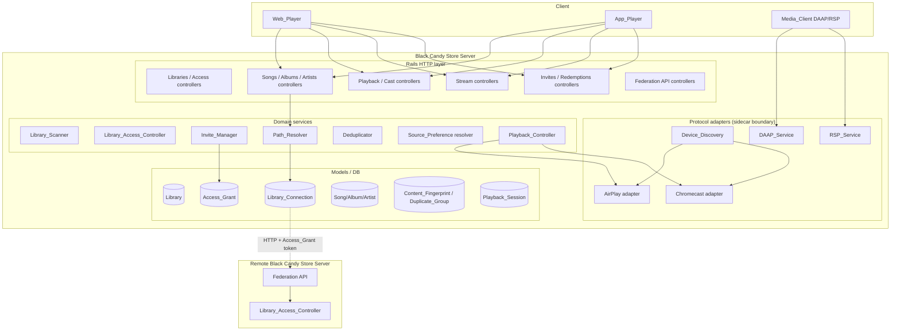
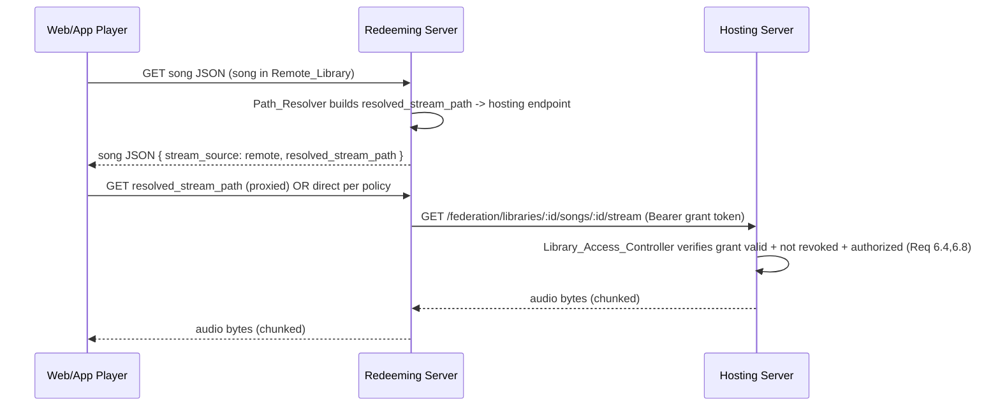
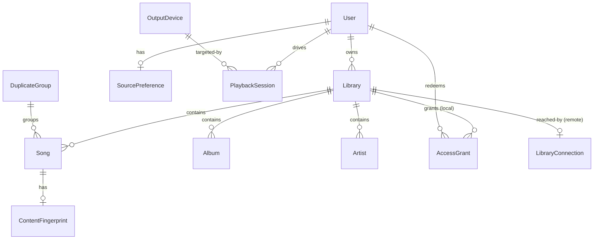

# Design Document

## Overview

Black Candy Store extends the single-media-path Black Candy server into a multi-library, multi-server music platform modeled after Plex. The design layers eighteen requirements onto the existing Rails architecture (`Song`, `Album`, `Artist`, `Playlist`, `User`, `Setting`, `Session`, `Stream`, `MediaFile`, `Media`) without breaking existing single-path deployments.

The core mental shift is that today's implicit collection (everything under `MEDIA_PATH`) becomes an explicit **Default_Library**, and every `Song`/`Album`/`Artist` gains a library association. Once content is library-scoped, three capabilities stack on top:

1. **Multiple local libraries** — one server hosts several named libraries, each with its own media path and independent scan lifecycle.
2. **Invite-code sharing and cross-server access** — a server owner mints an opaque invite code scoped to one library; a user on another server redeems it, establishing a persistent `Library_Connection` and a revocable `Access_Grant`.
3. **Unified resolution and playback** — songs, artwork, metadata, and playlists resolve transparently across local and remote sources; content is deduplicated across libraries; playback routes either through the client (`client_cast`) or the server (`server_playback`) to discovered AirPlay/Chromecast devices, and libraries are optionally exposed over DAAP/RSP.

Because the scope is very large, the design is explicitly **phased** (see the Phased Delivery Plan section). Each phase is independently shippable and leaves the system in a working state.

### Design Principles

- **Backward compatibility first.** Existing songs, existing cover images, and the existing `url` field in song JSON keep working unchanged. New fields are additive.
- **Resolution at the edge.** The `url` field consumed by the Web_Player and App_Player (built in `app/helpers/song_helper.rb`) becomes a *resolved* path. Players stay dumb — they always fetch from `resolved_stream_path` regardless of local/remote.
- **Authorization is server-side and defense-in-depth.** A credential match is necessary but never sufficient (Req 6.8); every request re-checks the `Access_Grant` state and the requesting user's library authorization.
- **Pure logic is separated from protocol I/O.** Invite encoding, dedupe classification, source-preference selection, and playback state machines are pure and property-tested. AirPlay/Chromecast/DAAP/RSP protocol handling is isolated behind adapters and covered by integration/smoke tests.

### Notable Technical Risks

These are flagged early because they materially affect feasibility and phasing:

- **AirPlay / Chromecast protocol implementation in Ruby (High risk).** There is no mature, maintained pure-Ruby AirPlay 2 or Chromecast sender stack. Server-driven playback (Req 14) and device discovery (Req 13) will almost certainly require external components (e.g., an out-of-process helper using `nodejs` `castv2`/`AirTunes` libraries, `shairport-sync`, or a Go/Rust sidecar) reached over a local IPC/HTTP boundary. The Rails side owns session state and control; the sidecar owns wire protocols.
- **Synchronized multi-room audio (High risk).** AirPlay multi-room grouping (Req 14.2) requires tight clock synchronization that Ruby cannot drive directly. This depends entirely on the sidecar's capabilities and is the least certain requirement.
- **DAAP / RSP serving (High risk).** DAAP (iTunes) and RSP (Roku) are legacy binary/HTTP protocols with no maintained Ruby servers. These likely need a dedicated service (e.g., `forked-daapd`/`owntone` style) fronted by Black Candy's auth, or a from-scratch protocol implementation. Deferred to the last phase.
- **Audio fingerprinting for dedupe (Medium risk).** Robust acoustic fingerprinting (Chromaprint/AcoustID via the `fpcalc` binary) adds a native dependency. The design keeps fingerprinting pluggable: `md5_hash` equality and normalized-metadata matching work with zero new dependencies; acoustic fingerprint is an optional enrichment.
- **Cross-server trust and availability (Medium risk).** Remote streaming introduces network partitions, timeouts, and credential revocation races. The design treats every remote call as fallible with explicit timeouts (Req 5.2 30s, Req 6.3 10s, Req 8.12 30s).

## Architecture

### High-Level Component Map



### Request Flow: Browsing the Active Library

1. `SongsController#index` (and album/artist/search controllers) call a shared scope helper that restricts results to `Current.user.active_library` (Req 3.2).
2. `Library_Access_Controller` verifies the user is authorized for that library before any content is returned (Req 3.3, 3.6).
3. For each returned song/album/artist, `Path_Resolver` computes `stream_source` / `resolved_stream_path` and `asset_source` / `resolved_asset_path` (Req 8, 9), applying `Source_Preference` and dedupe where the same content is reachable from multiple sources (Req 11, 12).

### Request Flow: Cross-Server Streaming



The design **proxies remote streams through the redeeming server** rather than handing the hosting URL directly to the browser. This keeps the `Access_Grant` credential server-side (never exposed to the browser), lets the redeeming server enforce its 10s timeout (Req 6.3), and preserves the "players need no library-specific logic" guarantee (the `resolved_stream_path` is always a same-origin URL from the player's perspective). The trade-off is redeeming-server bandwidth; acceptable given the self-hosted context.

### Cross-Server HTTP API Contract (Federation API)

All inter-server calls use HTTPS and a Bearer token equal to the `Access_Grant` secret token. Namespace: `/federation`.

| Purpose | Method & Path | Auth | Request | Response |
|---|---|---|---|---|
| Confirm grant at redemption (Req 5.2) | `POST /federation/grants/confirm` | Bearer grant token | `{ library_id }` | `200 { library: {id,name}, valid: true }` or `403` |
| Browse remote library (Req 6.1) | `GET /federation/libraries/:id/{songs,albums,artists}` | Bearer grant token | pagination params | JSON lists (same shape as local) |
| Stream a remote song (Req 6.2) | `GET /federation/libraries/:id/songs/:song_id/stream` | Bearer grant token | range headers | audio bytes |
| Fetch remote asset (Req 9.4, 9.6) | `GET /federation/libraries/:id/{albums,artists}/:id/asset` | Bearer grant token | `?variant=` | image bytes / metadata JSON |
| Health/liveness for timeouts | `GET /federation/ping` | Bearer grant token | — | `200` |

**Credential / auth model.** When a cross-server invite is redeemed, the redeeming server stores a `Library_Connection` holding `{ server_base_url, remote_library_id, grant_token }`. The `grant_token` is the same secret encoded in the invite code and recorded (hashed) in the hosting server's `Access_Grant`. Every federation request presents this token as `Authorization: Bearer <grant_token>`. The hosting server's `Library_Access_Controller`:

1. Hashes the presented token and looks up a matching `Access_Grant` (Req 6.6 — no match → 403 regardless of anything else).
2. Rejects if the grant is `revoked` or `expired` (Req 6.5), returning an explicit authorization error body (not a silent drop).
3. Performs additional checks — the grant references the requested `library_id`, and the library still exists (Req 6.8, defense-in-depth: match alone is never sufficient).

Tokens are stored hashed at rest on the hosting side (like a password digest) and compared with a constant-time comparison. The invite code itself carries the plaintext token to the redeemer exactly once.

## Components and Interfaces

### Library_Scanner

Generalizes the existing `Media` sync pipeline (`Media.sync`, `MediaSyncAllJob`) to operate per-library. Today `MediaSyncAllJob#perform(dir = Setting.media_path)` scans one global path; the scanner becomes `LibraryScanJob#perform(library_id)` scanning `library.media_path` and stamping `library_id` on every created `Song`/`Album`/`Artist`.

```ruby
class LibraryScanJob < MediaSyncJob
  def perform(library_id)
    library = Library.local.find(library_id)
    library.update!(scan_state: :syncing)                       # Req 2.6
    file_paths = MediaFile.file_paths(library.media_path)
    # Media.sync variant that associates content with library_id (Req 2.1, 2.2)
    ensure # Req 2.7 / 2.8
      library.reload.syncing? and library.update!(scan_state: :failed) # terminated mid-scan
  end
end
```

- Scan state per library: `idle | syncing | failed` (Req 2.6, 2.7, 2.8), replacing the global `Media.syncing?` cache flag with a per-`Library` column plus a broadcast.
- Content creation (`Media#attach`) is parameterized by `library_id`; the `create_or_find_by!(md5_hash:)` lookup becomes scoped to `(library_id, md5_hash)` so the same file under two libraries yields two songs (Req 2.3).

### Invite_Manager

Pure encode/decode plus persistence. Isolated so the round-trip property (Req 4.7) is directly testable.

```ruby
module InviteManager
  # Encodes { server_base_url, secret_token } into one opaque string.
  def self.encode(server_base_url:, secret_token:) -> String
  def self.decode(invite_code) -> { server_base_url:, secret_token: } | raise Malformed
  def self.generate(library:, owner:, expires_in: 7.days) -> Invite   # Req 4.1-4.5
  def self.redeem(invite_code:, user:) -> RedemptionResult            # Req 5.*
  def self.revoke(access_grant:, owner:) -> AccessGrant               # Req 7.*
end
```

- Encoding = Base64URL of a JSON `{u: base_url, t: token}` (or a signed compact token). Decoding reverses it; malformed input raises (Req 5.3).
- `secret_token` = `SecureRandom.hex(16)` → 128 bits (Req 4.2).
- `generate` validates ownership (Req 4.6), library existence (Req 4.9), and expiration range 1 minute–365 days (Req 4.5, 4.8).

### Library_Access_Controller

A controller concern + service that centralizes authorization for both local browsing and federation requests.

```ruby
module LibraryAccess
  def authorized_libraries(user)         # local owned + active remote connections (Req 3.4)
  def authorize_library!(user, library)  # raises Forbidden if not permitted (Req 3.3, 3.6)
  def authorize_grant!(token, library_id) # federation path (Req 6.4, 6.5, 6.6, 6.8)
end
```

### Path_Resolver

The heart of Requirements 8, 9, 10. Extends `song_json_builder` and the album/artist JSON so every serialized entity carries source classification and a resolved path.

```ruby
class PathResolver
  # Song -> { stream_source: "local"|"remote", resolved_stream_path: String }
  def resolve_stream(song, user:)
  # Album/Artist asset -> { asset_source:, resolved_asset_path: }
  def resolve_asset(record, user:, variant:)
end
```

- `local` songs → existing `new_stream_url` / `new_transcoded_stream_url` (Req 8.4, 8.8).
- `remote` songs → a same-origin proxy URL (`/stream/remote/:song_id`) that the redeeming server maps to the hosting federation endpoint (Req 8.5).
- Unresolvable remote (revoked/unreachable connection) → empty path + `available: false`, other attributes preserved (Req 8.11, 10.4, 10.5).
- Unknown library association → treated as `local` (Req 8.9).
- When the same logical track is reachable from multiple sources, `Source_Preference` selects the copy before resolving (Req 8.13, 12.6).

### Deduplicator & Source_Preference resolver

```ruby
module Deduplicator
  def self.fingerprint(song) -> ContentFingerprint      # Req 12.1
  def self.same_content?(a, b) -> Boolean                # Req 12.1,12.2,12.8,12.9
  def self.group(songs) -> [DuplicateGroup]              # Req 12.3,12.10
end

module SourcePreference
  # Selects exactly one playable Song from a Duplicate_Group for a user (Req 11, 12.6, 12.11)
  def self.select(duplicate_group, user:) -> Song | nil
end
```

- `same_content?` is defined to be reflexive, symmetric, and transitive (an equivalence relation), which makes grouping well-defined (Req 12.8–12.11).
- `SourcePreference.select` implements the deterministic ordering: preference (own-server vs highest-quality) → quality tiebreak (lossless, then bit_depth, then bitrate) → own-library → lowest library id (Req 11.4–11.8).

### Device_Discovery, Playback_Controller (sidecar boundary)

```ruby
module DeviceDiscovery
  def self.available_devices -> [OutputDevice]  # Req 13.2; empty + unavailable flag on failure (Req 13.5)
end

class PlaybackController            # Req 14
  # create/update session, play, resume, pause, stop, volume; state machine stopped|playing|paused
end
```

These delegate wire-protocol work to an out-of-process **playback sidecar** over a local HTTP/gRPC boundary. Rails owns `Playback_Session`/`Cast_Session` state and control semantics (fully property-testable); the sidecar owns AirPlay/Chromecast framing (integration/smoke only).

### DAAP_Service / RSP_Service

Enabled/disabled via new `Setting` flags (Req 15.3). Serve only local, authorized content (Req 15.8, 15.10). Realistically implemented by fronting/embedding an external media server; deferred to Phase 5.

## Data Models

### Entity-Relationship Overview



### New and Modified Tables

**`libraries`** (new)

| Column | Type | Notes |
|---|---|---|
| `id` | pk | |
| `name` | string, null: false | 1–255 chars, unique per server (Req 1.2, 1.9) |
| `kind` | string, null: false | `local` or `remote` |
| `media_path` | string | required for `local`; validated exist+readable (Req 1.3, 1.4, 1.11) |
| `owner_id` | fk users | server owner (Req 1.8) |
| `scan_state` | string, default `idle` | `idle｜syncing｜failed` (Req 2.6–2.8) |
| `is_default` | boolean, default false | the backfilled Default_Library (Req 1.7) |
| `library_connection_id` | fk, nullable | set for `remote` libraries |

Unique index on `name` (case-insensitive) enforces Req 1.2/1.10.

**`songs` / `albums` / `artists`** (modified)

- Add `library_id` (fk, not null after backfill). Every song belongs to exactly one library (Req 2.2).
- **Relax the `md5_hash` unique index.** Today `index_songs_on_md5_hash` is globally unique. Change to a composite unique index on `(library_id, md5_hash)` so the same file under two libraries produces two songs (Req 2.3).
- **Relax album/artist uniqueness.** `index_albums_on_artist_id_and_name` and `index_artists_on_name` become scoped to `library_id` so each library owns its own album/artist rows. Cross-library grouping is handled logically by the Deduplicator (Req 12.5), not by shared rows.
- Deleting a library removes its songs and cascades album/artist cleanup exactly as `Media.clean_up` already does, but scoped — an album/artist is removed iff no song remains for it (Req 2.4, 2.5).

**`access_grants`** (new — on the hosting server)

| Column | Type | Notes |
|---|---|---|
| `id` | pk | |
| `library_id` | fk libraries (local) | Req 4.1 |
| `token_digest` | string, null: false | hashed secret token; constant-time compare |
| `redeemer_user_id` | fk, nullable | set on local redemption (Req 5.1) |
| `redeemer_identity` | string, nullable | opaque id of remote redeemer server/user |
| `status` | string, default `active` | `active｜revoked` (Req 7.2) |
| `expires_at` | datetime | default now+7d (Req 4.4, 4.5) |
| `redeemed_at` | datetime, nullable | redemption record (Req 5.1, 7.1) |

Deleting a library deletes its grants (Req 1.6).

**`library_connections`** (new — on the redeeming server)

| Column | Type | Notes |
|---|---|---|
| `id` | pk | |
| `server_base_url` | string | issuing server (Req 5.2) |
| `remote_library_id` | integer | id on hosting server |
| `grant_token` | string (encrypted) | Bearer credential (Req 6.2) |
| `user_id` | fk users | owner of this connection |
| `status` | string, default `active` | `active｜revoked｜unavailable` |

Unique on `(user_id, server_base_url, remote_library_id)` prevents duplicate connections (Req 5.9).

**`users`** (modified) — add via existing scoped-setting pattern (`has_setting`):
- `active_library_id` (persisted selection, survives sessions — Req 3.1).
- `source_preference` → `prefer_own_server` (default) or `prefer_highest_quality` (Req 11.1, 11.2, 11.10).
- `playback_mode` → `client_cast` or `server_playback` (Req 16.2–16.4).

**`settings`** (modified) — add `enable_daap` / `enable_rsp` booleans (Req 15.3), following the existing `has_setting` style.

**Dedup tables** (new)
- `content_fingerprints`: `song_id` fk, `md5_hash`, `acoustic_fingerprint` (nullable), `normalized_key` (name|artist|album|duration). Req 12.1.
- `duplicate_groups`: `id`, `logical_track_key`. `songs.duplicate_group_id` fk nullable groups members (Req 12.3).

**Playback tables** (new — Phase 4)
- `output_devices` (ephemeral/cache): `identifier`, `name`, `protocol` (`airplay｜chromecast`), `requires_password`, `reachable_at`. Discovery-maintained (Req 13).
- `playback_sessions`: `user_id`, `state` (`stopped｜playing｜paused`), `current_song_id`, `position`, serialized `active_output_device_ids` (Req 14.15). `Cast_Session` is client-side state mirrored to a lightweight server record only for bookkeeping (Req 18.2, 18.3).

### Default_Library Backfill Migration (Req 1.7, 8.8, 9.5)

A data migration runs on upgrade:

1. Create one `Library` with `kind: local`, `is_default: true`, `name: "Default Library"`, `media_path: Setting.media_path`, `owner_id:` first admin.
2. `UPDATE songs SET library_id = <default>` for all rows with null `library_id`; same for `albums`, `artists`.
3. Existing ActiveStorage `cover_image` attachments are untouched; the resolver classifies them as `local` with their pre-existing URL (Req 9.5).
4. Existing stream URLs for these songs remain the current-server paths (Req 8.8).

This guarantees a pre-feature deployment behaves identically after upgrade: one library, local sources, unchanged URLs.

## Correctness Properties

*A property is a characteristic or behavior that should hold true across all valid executions of a system — essentially, a formal statement about what the system should do. Properties serve as the bridge between human-readable specifications and machine-verifiable correctness guarantees.*

These properties apply to the **pure logic** of this feature: invite encoding, library validation, content scoping, dedupe classification, source-preference selection, path resolution, playback state machines, and authorization containment. They do **not** apply to protocol I/O (AirPlay/Chromecast/DAAP/RSP wire behavior), network calls to remote servers, mDNS discovery, or client-device streaming — those are covered by integration and smoke tests (see Testing Strategy). The properties below are the consolidated set from the prework analysis, with redundant properties merged.

### Property 1: Library name acceptance is valid-and-unique

*For any* candidate library name, the Server SHALL accept it if and only if its whitespace-trimmed length is between 1 and 255 characters and it does not duplicate (case-insensitively) an existing local library name on the Server; rejected submissions SHALL leave every existing library unchanged.

**Validates: Requirements 1.2, 1.9, 1.10**

### Property 2: Every song belongs to exactly one library

*For any* set of scanned content, each Song SHALL be associated with exactly one Library.

**Validates: Requirements 2.2**

### Property 3: Same file under two libraries yields two songs

*For any* media file present under the media paths of two distinct Local_Libraries, scanning SHALL produce two separate Songs, one associated with each Library.

**Validates: Requirements 2.3**

### Property 4: Library deletion cascade preserves exactly the still-referenced albums and artists

*For any* dataset of songs, albums, and artists across libraries, deleting a Local_Library SHALL remove that Library's songs and SHALL remove an Album or Artist if and only if no song remains associated with it afterward.

**Validates: Requirements 2.4, 2.5**

### Property 5: Browsing results are scoped to the active library

*For any* User with an Active_Library over any multi-library dataset, the songs, albums, and artists returned by browsing, searching, and listing SHALL be a subset of the Active_Library's content and SHALL be disjoint from the content of every other Library.

**Validates: Requirements 3.2, 3.7**

### Property 6: Invite code round-trips

*For any* issuing Server base URL and secret token, decoding the Invite_Code produced by encoding them SHALL yield the same base URL and secret token.

**Validates: Requirements 4.7**

### Property 7: Malformed invite codes are rejected without side effects

*For any* string that is not a valid Invite_Code encoding, redemption SHALL be rejected as malformed and SHALL leave the User's existing access unchanged.

**Validates: Requirements 5.3**

### Property 8: Invite expiration duration validation

*For any* requested expiration duration, the Invite_Manager SHALL create the invite with `expires_at = created_at + duration` if and only if the duration is between 1 minute and 365 days inclusive, and SHALL otherwise reject the request without creating an Access_Grant.

**Validates: Requirements 4.5, 4.8**

### Property 9: Redemption is idempotent

*For any* Invite_Code already redeemed by a User whose Access_Grant is not revoked, redeeming it again SHALL report success and SHALL leave the access state unchanged, creating no duplicate Access_Grant and no duplicate Library_Connection.

**Validates: Requirements 5.6, 5.9**

### Property 10: Federation content requires an authorized, active, non-revoked grant

*For any* presented credential token and any set of Access_Grants in arbitrary states, the hosting Server's Library_Access_Controller SHALL return the requested Library's content if and only if the token matches exactly one Access_Grant whose status is active, whose `expires_at` is in the future, and which references the requested Library; in every other case it SHALL reject with an authorization error and return no content.

**Validates: Requirements 6.5, 6.6, 6.8, 7.3, 7.4**

### Property 11: Revocation is local and idempotent

*For any* set of Access_Grants for a Local_Library, revoking one grant SHALL set that grant's status to revoked and SHALL leave the state of every other grant unchanged; revoking a grant that is already revoked SHALL leave it revoked and report success without further change.

**Validates: Requirements 7.6, 7.7**

### Property 12: Stream-source classification and resolution are consistent

*For any* Song returned to the Web_Player or App_Player, the response SHALL include a `stream_source` of `local` when the Song's Library is a Local_Library (including the Default_Library and any Song whose Library association cannot be determined) or `remote` when it is a Remote_Library, and when resolution succeeds the `resolved_stream_path` SHALL be non-empty and point to the current Server for `local` sources and to the hosting Server's derived endpoint for `remote` sources.

**Validates: Requirements 8.1, 8.3, 8.4, 8.5, 8.8, 8.9, 8.10**

### Property 13: Unresolvable remote content yields an empty path and preserves other attributes

*For any* Song whose `stream_source` is `remote` and whose Library_Connection cannot be resolved to a streaming endpoint, the Server SHALL set its `resolved_stream_path` to empty, mark it unavailable, and preserve all of the Song's other attributes unchanged. The analogous rule SHALL hold for a Displayable_Asset whose owning content's Library_Connection cannot be resolved.

**Validates: Requirements 8.11, 9.8**

### Property 14: Asset-source classification and resolution are consistent

*For any* Album or Artist returned to the Web_Player, App_Player, or API, each available Displayable_Asset SHALL carry an `asset_source` of `local` or `remote` matching its owning content's Library kind, and when resolution succeeds and a cover image is available the `resolved_asset_path` SHALL be non-empty; when no cover image is available the `resolved_asset_path` SHALL be empty with an absence indication.

**Validates: Requirements 9.1, 9.2, 9.3, 9.4, 9.5, 9.7, 9.9**

### Property 15: Playlist resolution preserves order and membership and resolves each song independently

*For any* Playlist containing a mix of local and remote Songs, the returned Playlist SHALL preserve the original order and membership, resolve each Song's `stream_source` and `resolved_stream_path` independently according to that Song's own Library, and set only the unavailable Songs' `resolved_stream_path` to empty while leaving every other Song's resolution unchanged; the Playlist response SHALL never be rejected as a whole.

**Validates: Requirements 10.3, 10.4, 10.5, 10.6, 10.7, 10.8**

### Property 16: Same-content classification is reflexive and symmetric

*For any* Song, the Deduplicator SHALL classify it as the same content as itself; and *for any* pair of Songs A and B, if the Deduplicator classifies A as the same content as B then it SHALL classify B as the same content as A. Two Songs with identical `md5_hash` or identical Content_Fingerprint SHALL be classified as the same content.

**Validates: Requirements 12.1, 12.2, 12.8, 12.9**

### Property 17: Identical fingerprints are grouped together, distinct ones apart

*For any* set of Songs, the Deduplicator SHALL place every pair of Songs with identical Content_Fingerprints into the same Duplicate_Group and SHALL place every pair with non-matching Content_Fingerprints into different Duplicate_Groups.

**Validates: Requirements 12.3, 12.4, 12.10**

### Property 18: Source preference selects exactly one copy deterministically

*For any* Duplicate_Group with at least one available copy and any User Source_Preference, the Server SHALL select exactly one playable Song according to the deterministic ordering — under `prefer_own_server`: the copy in the User's own Local_Library, else the highest-quality copy; under `prefer_highest_quality`: the highest-quality copy ranked by lossless status, then bit depth, then bitrate — with ties broken by preferring the User's own Local_Library and otherwise the lowest Library identifier; and when no copy is available it SHALL select none and mark the content unavailable.

**Validates: Requirements 11.4, 11.5, 11.6, 11.7, 11.8, 11.9, 12.6, 12.7, 12.11**

### Property 19: Preference and playback-mode value validation

*For any* submitted Source_Preference value, the Server SHALL persist it and apply it if and only if it is `prefer_own_server` or `prefer_highest_quality`, otherwise rejecting it and leaving the existing value unchanged; and *for any* submitted Playback_Mode value, the Server SHALL record it if and only if it is `client_cast` or `server_playback`, otherwise rejecting it and leaving the existing mode unchanged.

**Validates: Requirements 11.10, 16.4**

### Property 20: Playback and cast sessions maintain a valid state and correct resume transition

*For any* sequence of control operations applied to a Playback_Session or Cast_Session, the session state SHALL always be exactly one of `stopped`, `playing`, or `paused`; a play or resume operation on a session with no active Output_Device SHALL be rejected leaving the state unchanged; when the last active Output_Device becomes unavailable during `playing` the state SHALL become `stopped`; and a resume applied immediately after a pause SHALL return the session to `playing` with the same current Song and playback position retained at pause.

**Validates: Requirements 14.11, 14.12, 14.13, 14.14, 14.15, 14.16, 17.11, 17.12, 17.14, 17.16**

### Property 21: Playback mode is exclusive and determines the audio source

*For any* set of concurrent playback activities, each activity SHALL be classified as exactly one Playback_Mode; an activity in `client_cast` mode SHALL be managed by a Cast_Session with the Cast_Client as audio source and not the Server, and an activity in `server_playback` mode SHALL be managed by a Playback_Session with the Server as audio source and not the Web_Player or App_Player; no activity SHALL be managed by both a Cast_Session and a Playback_Session, and every concurrent `client_cast` activity SHALL be managed.

**Validates: Requirements 16.5, 16.6, 16.7, 18.1, 18.4, 18.5, 18.6**

### Property 22: DAAP/RSP served content is local and authorized

*For any* connecting Media_Client and any library/authorization configuration, the content served over the DAAP_Service or RSP_Service SHALL be a subset of the Local_Library content the authenticated account is authorized to access and SHALL contain no Remote_Library content; when an account's authorization to a Local_Library is revoked, that Library's content SHALL no longer be served to that account.

**Validates: Requirements 15.8, 15.9, 15.10**

### Property 23: Output devices are classified with exactly one protocol

*For any* set of discovered Output_Devices, the Server SHALL classify each device as exactly one of `airplay` or `chromecast` and SHALL report each device's password requirement.

**Validates: Requirements 13.2, 13.6**

## Error Handling

Errors follow the existing exception model (`BlackCandy::Unauthorized`, `BlackCandy::Forbidden`, and the `errors_controller` 403/404/422/500 routes) with these additions:

| Condition | Requirement | Handling |
|---|---|---|
| Library media path missing / unreadable / unverifiable | 1.3, 1.4, 1.11 | Validation error on the `Library` model (mirrors `Setting#media_path_exist`), submission rejected, existing library unchanged |
| Non-owner creates/modifies library or invite or views/revokes grants | 1.8, 4.6, 7.5 | `BlackCandy::Forbidden` (403) via `require_admin` / ownership check |
| Malformed invite code | 5.3 | Decode raises `InviteManager::Malformed`; redemption returns a validation error; access unchanged |
| Expired invite (first-time redemption) | 5.4 | Redemption rejected with expiration error; already-redeemed non-revoked codes still succeed (5.6) |
| Revoked grant on redemption or federation request | 5.5, 6.5, 7.3, 7.4 | Explicit authorization error body (never a silent drop, per 6.5) |
| Issuing server unreachable / >30s at redemption | 5.7 | Redemption rejected, no Library_Connection created, "issuing server unavailable" error; timeout enforced with `Net::HTTP`/Faraday `open_timeout`/`read_timeout` |
| Hosting server >10s serving remote content | 6.3 | "Remote_Library unavailable" error; Library_Connection retained unchanged |
| Hosting server returns authorization error mid-use | 6.7 | Redeeming server surfaces "access no longer available"; other library access retained |
| Remote Library_Connection unresolvable | 8.11, 9.8, 10.4, 10.5 | `resolved_*_path` empty + `available: false`; other attributes/songs preserved |
| Player receives no audio within 30s | 8.12, 17.13 | Client-side: stop request, indicate song unavailable |
| Scanner terminates mid-scan | 2.8 | `scan_state: failed` recorded; library stops reporting `syncing` (ensure/at_exit + stale-lock reconciliation) |
| Invalid Source_Preference / Playback_Mode value | 11.10, 16.4 | Validation error; existing value unchanged |
| Play/resume with no active Output_Device | 14.14 | Rejected with "no device selected"; session state unchanged |
| Selecting an unreachable Output_Device | 14.13 | Rejected with "device not reachable"; active devices unchanged |
| Device password missing/incorrect | 14.8, 17.10 | Authentication error; audio not sent to that device |
| Output device lost during playback | 14.11, 14.12, 17.12 | Remove device and continue; if last device lost, state → stopped with reason |
| Device discovery unavailable | 13.5 | Empty device set + "discovery unavailable" indication |
| Media_Client fails DAAP/RSP auth | 15.7 | Connection refused with authentication error; no content served |

Cross-server calls are wrapped in a shared `Federation::Client` that centralizes timeouts, retries (none for auth failures), and error translation so controllers handle a small set of domain exceptions rather than raw HTTP errors.

## Testing Strategy

### Dual Approach

- **Property-based tests** verify the 23 universal properties above across many generated inputs. The pure logic (invite encode/decode, dedupe classification, source-preference selection, path resolution given library metadata, session state machines, authorization predicates) is extracted so it can be tested without I/O.
- **Unit / example tests** cover concrete scenarios, edge cases, and error branches (specific validation messages, the Default_Library backfill migration, single-library default selection, logging of rejected selections).
- **Integration tests** cover the fallible, I/O-bound, and protocol paths that are NOT suitable for PBT.

### Property-Based Testing

- Library: **`rspec` + `rantly`** (or `propcheck`) for Ruby property tests, matching the existing RSpec/Minitest setup (confirm the project's test framework and add the property library rather than hand-rolling generators).
- Each property test runs a **minimum of 100 iterations**.
- Each property test is tagged with a comment referencing its design property, in the format:
  `# Feature: multi-server-library-sharing, Property {number}: {property_text}`
- Each of the 23 properties is implemented by a **single** property-based test with a purpose-built generator (random library sets, songs across local/remote/default/unknown libraries, grant sets in mixed states, candidate copy sets with varying quality, and random operation sequences for the session state machines).
- Generators explicitly exercise edge cases folded into properties: whitespace-only and 256-char names (Prop 1), non-ASCII/empty strings for invite decoding (Prop 7), zero-source dedupe groups (Prop 18), and empty device sets (Prop 23).

### Integration & Smoke Tests (NOT property-based)

- **Cross-server federation** (Req 5.2, 5.7, 5.8, 6.2, 6.3, 6.4, 9.6): 1–3 examples against a stubbed hosting server (e.g., `WebMock`/a spun-up test server) verifying grant confirmation, remote browse/stream/asset fetch, timeout behavior, and revocation-mid-use.
- **Device discovery** (Req 13.1, 13.3, 13.4): integration tests against the playback sidecar with mocked mDNS advertisements; smoke test that discovery returns an empty set gracefully when the sidecar is absent (Req 13.5).
- **Server-driven playback audio path** (Req 14.2, 14.7–14.10): integration tests against the sidecar verifying audio is dispatched, password-protected devices require credentials, and local vs remote decoding paths are exercised; multi-room sync verified manually / with a hardware-in-the-loop smoke test given the risk noted above.
- **Client casting device path** (Req 17.3–17.10): client-side integration tests; the Cast_Session *state logic* is covered by Property 20.
- **DAAP/RSP serving** (Req 15.1–15.7): integration/smoke tests against real DAAP (iTunes) and RSP (Roku) clients or a conformance harness; the *content-selection* logic is covered by Property 22.
- **Backfill migration** (Req 1.7, 8.8, 9.5): a migration test that loads a pre-feature schema fixture, runs the migration, and asserts one Default_Library, all content associated, unchanged cover-image URLs, and unchanged stream URLs.

### Verification Notes for Risky Areas

The sidecar-dependent requirements (13, 14, 17 audio path, 15) are the least amenable to automated verification. The design deliberately concentrates automatically-verifiable correctness in the Rails state machines and selection/resolution logic (Properties 18–23), so that the protocol adapters remain thin translators whose failures are contained and surfaced as the errors above.

## Phased Delivery Plan

The scope is large; each phase is independently shippable and leaves the system working. Tasks should be generated to follow this phasing.

### Phase 1 — Multi-library foundation, scanning, scoped browsing
**Requirements: 1, 2, 3.** **Properties: 1, 2, 3, 4, 5.**
- `Library` model + migration; add `library_id` to songs/albums/artists; relax `md5_hash` and album/artist unique indexes to be library-scoped.
- Default_Library backfill migration (Req 1.7).
- Generalize `Media`/`MediaSyncAllJob` into per-library `LibraryScanJob` with per-library `scan_state`.
- Active_Library selection (persisted on user), scope all browse/search/list controllers to the active library, `Library_Access_Controller` authorization.
- Delivers a working multi-library single server. No cross-server behavior yet.

### Phase 2 — Invite codes, cross-server access, remote streaming, resolved paths
**Requirements: 4, 5, 6, 7, 8, 9, 10.** **Properties: 6, 7, 8, 9, 10, 11, 12, 13, 14, 15.**
- `Invite_Manager` (encode/decode/generate/redeem/revoke), `Access_Grant`, `Library_Connection`.
- Federation API (controllers + `Federation::Client`) with grant-token auth and timeouts.
- `Path_Resolver` extending `song_json_builder` and album/artist JSON with `stream_source`/`resolved_stream_path` and `asset_source`/`resolved_asset_path`; remote-stream proxy endpoint.
- Playlist cross-server resolution.
- Delivers full cross-server browse/stream/share with revocation.

### Phase 3 — Deduplication and source preference
**Requirements: 11, 12.** **Properties: 16, 17, 18, 19 (Source_Preference half).**
- `Content_Fingerprint` (md5 + normalized metadata; optional `fpcalc` acoustic fingerprint), `Duplicate_Group`, `Logical_Track`.
- `Deduplicator` and `SourcePreference` resolver wired into `Path_Resolver`.
- Per-user Source_Preference setting.

### Phase 4 — Output devices, server-driven playback, client casting, playback modes
**Requirements: 13, 14, 16, 17, 18.** **Properties: 19 (Playback_Mode half), 20, 21, 23.**
- Playback sidecar boundary; `Device_Discovery`.
- `Playback_Controller` + `Playback_Session` state machine (server_playback).
- `Cast_Session` client-side state machine + controllers (client_cast).
- Playback_Mode selection and the mutual-distinction invariants.
- Highest technical risk (AirPlay/Chromecast, multi-room sync) is isolated here.

### Phase 5 — DAAP/RSP media client serving
**Requirements: 15.** **Property: 22.**
- `DAAP_Service`/`RSP_Service` behind server settings, local-authorized-content selection, external-client auth.
- Highest protocol risk; deliberately last so the rest of the platform is stable first.
