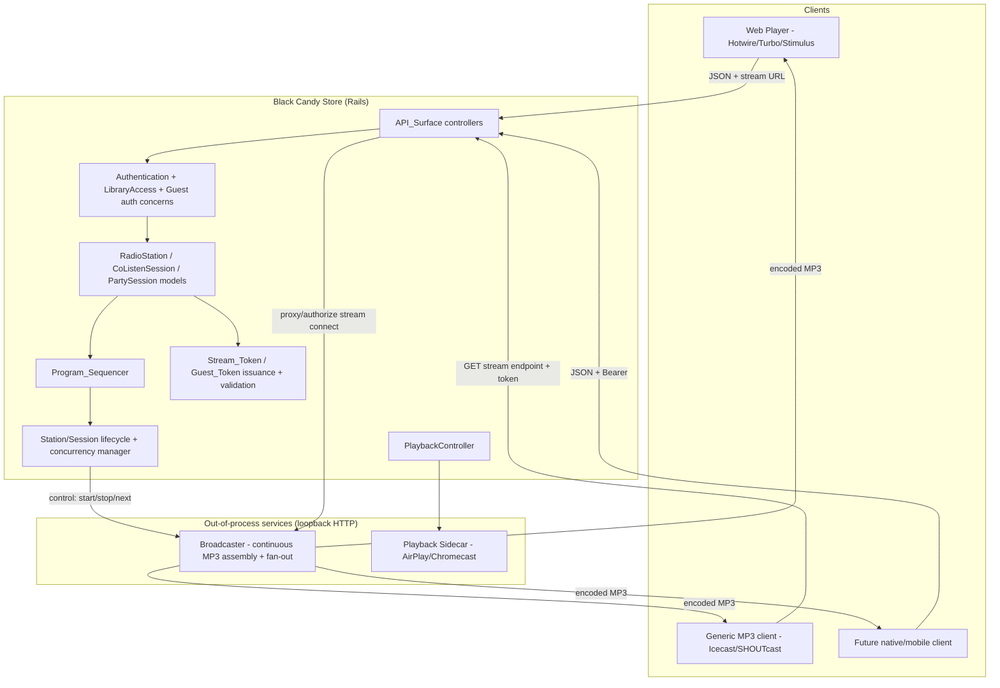
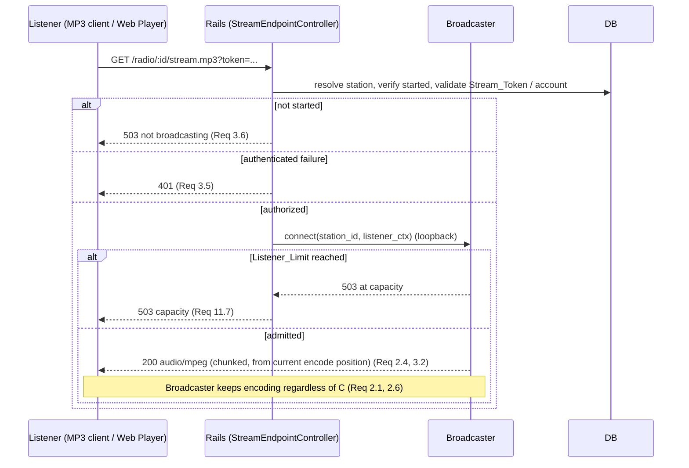
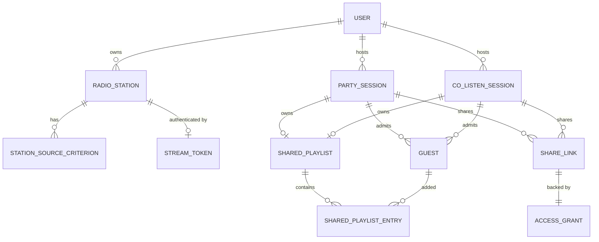

# Design Document

## Overview

This feature adds three social-listening capabilities to Black Candy Store: **Radio Stations**, **Party Mode**, and **Co-listen Mode**. (An optional AI DJ add-on was considered and deferred to a separate future spec; it is intentionally out of scope here.) The design deliberately reuses the platform's existing building blocks rather than reinventing them:

- **Authorization** is derived from `User#authorized_library_ids` and the `LibraryAccess` concern. Every station's eligible songs and every guest's readable content are computed from the existing library-scoped rules.
- **Guest and stream access** reuse the `AccessGrant` model (keyed token digest, `usable?` = active && not-expired, revocable, optional `expires_at`) for Share_Links, and reuse the signed, purpose-scoped, expiring token pattern already proven by the playback sidecar (`Song#signed_id(purpose: :sidecar_stream)` + `SidecarStreamAccess`) for URL-embedded Stream_Tokens.
- **Authentication** reuses the `Authentication` concern's dual path: session cookie for the Web_UI and non-cookie Bearer token for API clients. Guest_Tokens ride the Bearer path.
- **Shared-speaker output** for Party Mode reuses `OutputDevice`, `PlaybackController`, and `PlaybackSidecar` (`POST /play`, device dispatch).
- **Configuration** reuses the `has_setting` pattern (`Setting`, `GlobalSettingConcern`).
- **Streaming** builds on the existing transcoded-MP3 path (`Stream`, ffmpeg) but moves *continuous* assembly out of the Rails request cycle.

The single most consequential architectural decision is **where continuous MP3 encoding lives**. A radio stream must run independently of any HTTP request, survive with zero listeners, and fan a single encoded stream out to many listeners at the current position. Rails' request/response model (even with `ActionController::Live`) ties a stream to a request thread and cannot own an always-on broadcast. This design therefore introduces a dedicated, out-of-process **Broadcaster** service — a sibling to the existing playback sidecar — that owns continuous stream assembly, MP3 encoding, and Icecast-style listener fan-out, while Rails owns all state, sequencing decisions, scheduling, and authorization. This decision and its tradeoffs are detailed in the [Streaming / Broadcaster Architecture Decision](#streaming--broadcaster-architecture-decision).

### Requirements Coverage Map

| Requirement | Primary design sections |
| --- | --- |
| 1 Define a Radio Station | Data Models (`RadioStation`, `StationSourceCriterion`), Radio configuration API |
| 2 Continuous Shared Stream | Broadcaster, Program_Sequencer, Continuity_Audio |
| 3 Standard MP3 endpoint | Broadcaster, Stream_Endpoint, Stream auth |
| 4 Create/configure Party Session | Data Models (`PartySession`, `SharedPlaylist`), Share_Links |
| 5 Guest access | Guest model, Guest_Token, quotas/rate-limits, library scoping |
| 6 Party playback to devices | PlaybackController/Sidecar dispatch, host authority |
| 7 Co-listen Mode | `CoListenSession`, Broadcaster + Shared_Playlist |
| 8 Shared guest access model | AccessGrant-backed Share_Links, scoping/time-boxing |
| 9 API-first surface | API_Surface, JSON representations, Guest Bearer auth |
| 10 Lifecycle, persistence, concurrency | State machines, restart resume, concurrency cap |
| 11 Stream access control, listener limits | Stream_Token, Stream_Visibility, Listener_Limit |
| 12 Teardown | Session teardown orchestration |

## Architecture

### Component overview



The **control plane** (Rails) decides *what* plays and *who* may listen. The **data plane** (Broadcaster) does the continuous encoding and byte fan-out. Rails and the Broadcaster communicate over loopback HTTP, exactly mirroring the existing `PlaybackSidecar` seam (`PLAYBACK_SIDECAR_URL`, short timeouts, injectable client, transport errors mapped to domain errors).

### Listener join sequence (mid-stream, at current position)



Rails performs authorization once at connect time and then hands the byte stream off to the Broadcaster. Two viable wiring options exist for the audio bytes: (a) Rails reverse-proxies the Broadcaster's stream (single public surface, all auth centralized), or (b) Rails validates and issues a short-lived internal ticket, then 302-redirects the client to the Broadcaster's own listen port. This design chooses **(a) reverse-proxy through Rails** as the default because it keeps a single authenticated public surface, keeps the Broadcaster bound to loopback, and lets Listener_Limit accounting stay authoritative in one place; option (b) is noted as a scaling escape hatch.

## Components and Interfaces

### Rails control-plane components

**RadioStationsController / CoListenSessionsController / PartySessionsController** (`API_Surface`, Req 9)
- Client-agnostic JSON endpoints plus ERB/Hotwire views. Every action responds to both `format.html` (Turbo) and `format.json` (client-agnostic representation, Req 9.4). The same controller enforces identical authorization for HTML and JSON (Req 9.5).
- CRUD for stations/sessions, start/stop/activate/deactivate lifecycle, share-link generation, output-device selection, transport control, and shared-playlist contribution.

**Program_Sequencer** (`app/models/program_sequencer.rb`, pure/deterministic)
- Given a station's eligible-song set (or a session's Shared_Playlist) and a small amount of "recently played" history, selects the next item. This is a **pure function** seam (like `PlaybackController`) so it is property-testable without the Broadcaster.
- Selection contract: never returns an ineligible song; when the eligible set is exhausted it continues by re-selecting from the full eligible set (Req 2.3); when nothing is resolvable it returns a `:continuity` directive (Req 2.5, 7.9); for a Shared_Playlist that reached its end it loops from the beginning (Req 6.7, 7.8).

**StationLifecycleService / SessionLifecycleService** (`app/models`)
- Own the `Station_State` (`stopped`/`started`) and `Session_State` (`active`/`ended`) transitions (Req 10). Enforce ownership/admin authorization (Req 10.3, 10.9). Enforce the Admin-configurable concurrency cap before starting (Req 10.5, 10.6). On start, call the Broadcaster's control API to spin up a broadcast; on stop/teardown, tell the Broadcaster to end it and (for Party) tell `PlaybackController` to stop device playback (Req 12.1).
- Restart resume: a boot-time job (`ResumeStreamsJob`) queries persisted state and re-establishes every `started` station and every non-expired `active` co-listen session up to the concurrency cap (Req 10.4, 10.10); any session whose duration has expired is treated as ended (Req 12.4).

**Stream token/guest token services**
- `StreamToken`-issuance reuses the `AccessGrant`-style keyed-digest persistence for revocable/rotatable radio tokens (Req 11.5), and reuses `Song#signed_id`-style purpose-scoped signed tokens for guest-derived co-listen stream tokens (Req 11.8, 11.9).
- `GuestSession` admission issues a Guest_Token (non-cookie Bearer, Req 9.2) bound to a `Guest` record (Req 5.13).

**PlaybackController / PlaybackSidecar** (reused, Req 6)
- Party Mode dispatches the Shared_Playlist to host-selected `OutputDevice`s through the existing `POST /play` seam. No new sidecar contract is needed beyond passing the shared-playlist's current song and a signed stream token.

### Broadcaster service (new, out-of-process)

A dedicated companion service (co-located, loopback HTTP), architected as a sibling of the existing `playback-sidecar/`. It owns:

- **Continuous assembly + encoding**: for each active broadcast it runs an ffmpeg-based encode loop producing a constant-bitrate MP3 byte stream that advances in real time whether or not anyone is listening (Req 2.1, 2.6). It pulls each next source (song file / transcoded stream / continuity audio) from Rails-provided resolved paths + signed stream tokens.
- **Listener fan-out**: an Icecast/SHOUTcast-style endpoint that serves the *current position* to every joining listener (Req 2.4, 3.2, 7.4, 7.6), supporting zero-or-more concurrent listeners on the same position (Req 2.6).
- **Listener_Limit accounting** at the byte layer (Req 11.7), reported back to Rails.

Rails ⇄ Broadcaster control contract (loopback HTTP, JSON):

| Method | Purpose |
| --- | --- |
| `POST /broadcasts` | Start a broadcast for a station/session id; returns internal stream handle |
| `DELETE /broadcasts/:id` | Stop and tear down a broadcast (Req 10.2, 12.1) |
| `POST /broadcasts/:id/next` | Provide the next resolved source (song path + signed token, or continuity) — driven by Program_Sequencer decisions |
| `GET /broadcasts/:id/status` | Current encode position, listener count, uptime (for join + limits) |
| `GET /internal/broadcasts/:id/listen` | The raw MP3 fan-out (loopback only; Rails reverse-proxies public clients here) |

The Broadcaster keeps **no authoritative domain state**: on Broadcaster restart Rails re-establishes broadcasts from its own persisted `Station_State`/`Session_State` (Req 10.4), and the Broadcaster requests the next source from Rails so program decisions always originate in the sequencer.

## Data Models

New tables/migrations (all model names in Rails conventions; requirement-driven columns noted):

### RadioStation (`radio_stations`)
- `name:string` (validated 1..255, non-blank; Req 1.1, 1.6)
- `user_id` owner (Req 1.1, 1.8)
- `state:string` enum `stopped`/`started`, default `stopped` (Req 10.1, 10.2)
- `stream_visibility:string` enum `authenticated`/`public`, default `authenticated` (Req 11.1)
- `listener_limit:integer` nullable (Req 11.6)
- Associations: `has_many :station_source_criteria`, `has_one :stream_token`.
- `eligible_songs`: derived query — songs matching criteria **intersected with** `owner.authorized_library_ids` (Req 1.4). A create/update is rejected when this set is empty (Req 1.3, 1.9).

### StationSourceCriterion (`station_source_criteria`)
- `radio_station_id`
- `criterion_type:string` enum `artist`/`song`/`genre` (Req 1.2)
- `artist_id` / `song_id` / `genre` value column (polymorphic-by-type). Any combination allowed (Req 1.2). Recomputation on update recalculates `eligible_songs` (Req 1.5).

### PartySession (`party_sessions`)
- `user_id` host (Req 4.1), `state:string` enum `active`/`ended` (Req 10, 12)
- `session_duration_kind:string` enum `hours`/`days`/`perpetual`, `session_duration_value:integer` nullable (Req 4.3)
- `duplicate_policy:string` enum `reject`/`allow` (Req 5.10)
- `max_guests:integer`, `guest_add_quota:integer`, `guest_add_rate_per_minute:integer` (Req 5.9, 5.11)
- `has_one :shared_playlist`, `has_many :guests`, `has_many :share_links`, `has_many :party_output_devices` (selected devices, Req 6.1).
- `shared_library_ids:jsonb` — libraries the session shares, chosen from host's authorized libraries (Req 4.7).

### CoListenSession (`co_listen_sessions`)
- Same sharing/duration/guest columns as PartySession (Req 7.7) **plus** `listener_limit:integer` (Req 11.6).
- `state:string` enum `active`/`ended` (Req 10.7, 10.8). Produces a Shared_Stream (Req 7.1, 7.2). No `stream_visibility` — a co-listen stream is never public (Req 11.8).
- `has_one :shared_playlist`, `has_many :guests`, `has_many :share_links`.

### SharedPlaylist (`shared_playlists`) + SharedPlaylistEntry (`shared_playlist_entries`)
- `SharedPlaylist` belongs to a Party or Co-listen session (polymorphic `sessionable`).
- `SharedPlaylistEntry`: `shared_playlist_id`, `song_id`, `position:integer` (order, Req 6.3), `added_by_guest_id` nullable, `added_by_user_id` nullable (host), `guest_display_name:string` snapshot for attribution (Req 5.12). Removal/reorder authority enforced by these ownership columns (Req 6.6). Retained after teardown for host review (Req 12.3).

### Guest (`guests`)
- `sessionable` (polymorphic to Party/Co-listen), `display_name:string` optional (Req 5.12)
- `guest_token_digest:string` — keyed digest only, never plaintext (Req 8.7) — bound at admission (Req 5.13)
- `admitted_at`, `removed_at:datetime` nullable (removal ⇒ subsequent requests rejected, Req 5.8)
- `add_count:integer` + a rate-limit accounting column/window (Req 5.9).
- Guest identity for quota + removal enforcement is the token→Guest binding (Req 5.13).

### ShareLink (`share_links`)
- `sessionable` (polymorphic), `access_grant_id` (backing grant, Req 4.2, 8.1)
- The `AccessGrant` carries `expires_at` for hours/days durations, or nil for perpetual (Req 4.4, 4.5), is revoked to stop new joins (Req 4.6, 8.5), and stores only a keyed digest (Req 8.7). Because `AccessGrant` currently `belongs_to :library`, Share_Links for multi-library sessions are modeled as one grant per shared library (or an added nullable `sessionable` scope on the grant), keeping the existing `usable?`/`find_by_token` semantics intact (Req 8.2).

### StreamToken (`stream_tokens`)
- `radio_station_id` (radio) — `token_digest:string` (keyed digest only, rotatable/revocable, Req 11.5), `status` enum `active`/`revoked`.
- Co-listen stream tokens are **not** stored here; they are derived per-participant from the Guest_Token as purpose-scoped signed tokens (`signed_id(purpose: :colisten_stream)`) so they invalidate automatically when guest access ends (Req 11.8, 11.9).

### Setting additions (`has_setting`, Admin/global)
- `max_concurrent_streams:integer` (Req 10.5).

### Data model relationships



## Streaming / Broadcaster Architecture Decision

The requirement is an **always-on, listener-independent, standard-MP3, joinable-mid-stream** broadcast (Req 2, 3, 7). Three candidate homes for the continuous encode were evaluated:

| Option | How | Pros | Cons |
| --- | --- | --- | --- |
| **A. Rails streaming controller** (`ActionController::Live` + ffmpeg per request) | Each listener request opens a live response and pipes ffmpeg | Reuses existing `TranscodedStreamController` pattern; no new service | Fails core requirements: a stream tied to a request thread cannot run with zero listeners (Req 2.1/2.6), cannot share one encode across listeners at a common position (Req 2.4), and each always-on station would pin a Puma/Falcon thread indefinitely — exhausting the web tier |
| **B. Dedicated Broadcaster process** (new sibling to playback-sidecar) | Rails controls; Broadcaster encodes continuously + fans out | Meets always-on + fan-out + mid-stream join; isolates long-lived CPU (ffmpeg) from the web tier; mirrors the proven sidecar seam; Rails keeps all auth/state | New deployable component; a loopback contract to design and operate |
| **C. Embedded Icecast/Liquidsoap** | Run Icecast + a source client (e.g. Liquidsoap) | Battle-tested broadcast fan-out; native Icecast/SHOUTcast semantics | Heavy operational surface; program logic must be pushed into Liquidsoap scripting, splitting business logic away from Rails; harder to keep sequencing/authorization authoritative in Rails; auth for per-guest co-listen tokens becomes awkward |

**Decision: Option B — a dedicated Broadcaster service**, with the internal fan-out reverse-proxied through Rails so there is one authenticated public surface. Rationale: it is the only option that satisfies the always-on/fan-out/mid-stream requirements while keeping *all* domain logic (sequencing, token validation, listener limits, concurrency cap) authoritative in Rails and testable as pure seams. It reuses the existing out-of-process-sidecar operational model the team already runs, and it isolates sustained ffmpeg CPU from the request tier. Option C's Icecast internals are effectively re-implemented as the Broadcaster's fan-out but under our control; if scale demands it later, the Broadcaster's `listen` port can be fronted by real Icecast without changing Rails (a documented escape hatch). The Broadcaster MAY be implemented as a new role inside the existing `playback-sidecar/` service or as a separate process; either keeps continuous encoding out of Rails.

**Server restart resume** (Req 10.4, 10.10): Rails is the source of truth. A boot job re-creates broadcasts on the Broadcaster from persisted `started`/`active` state, honoring the concurrency cap and treating expired sessions as ended. Because the Broadcaster holds no authoritative state, either process can restart independently and reconverge.

**Concurrency cap** (Req 10.5, 10.6): enforced in Rails at start/activate time against the count of currently live broadcasts; exceeding it rejects with a capacity error and leaves state unchanged.

## Stream authentication

All three cases reuse the platform's existing token machinery via a new `StreamAuthorization` controller concern layered like `SidecarStreamAccess`:

1. **Authenticated radio** (Req 11.3, 11.4): the Stream_Endpoint URL carries a `token` query param validated against the station's `StreamToken` keyed digest (constant-time compare, exactly as `AccessGrant.authenticate_token`), **or** the request presents a valid session cookie / Bearer token for an account authorized to the station (via the existing `Authentication` path). Rotating/revoking the `StreamToken` invalidates the URL (Req 11.5).
2. **Public radio** (Req 3.7, 11.2): `stream_visibility == public` bypasses credential checks entirely and serves any client.
3. **Guest-scoped co-listen** (Req 11.8, 11.9): the URL carries a purpose-scoped signed token derived from the participant's Guest_Token (`signed_id(purpose: :colisten_stream)` bound to the session + shared libraries). Because it is derived from the Guest_Token and scoped to the session, it invalidates automatically on expiry/revocation/removal/teardown (Req 11.9). A co-listen stream is never public.

Validating a token embedded in a URL for a **long-lived** streaming connection is done **once at connect** (before the reverse-proxy hand-off). This matches how generic Icecast/SHOUTcast clients work — they cannot send cookies or `Authorization` headers (Assumption A3) — and mirrors the sidecar's URL-token approach. Listener_Limit is enforced at admission and continuously by the Broadcaster's listener accounting (Req 11.7).

## Guest / shared-session model

- **Admission** (Req 5.1): opening a valid Share_Link whose backing `AccessGrant` is `usable?` creates a `Guest` and issues a Guest_Token (Bearer, Req 9.2), unless `max_guests` is reached (capacity response, Req 5.11).
- **Guest authorization concern** (`GuestAccess`): resolves the Bearer Guest_Token to a `Guest` (keyed-digest lookup), rejects removed/expired/ended sessions (Req 5.6, 5.8, 12.2), and scopes every read/add to the session's shared libraries (Req 5.3, 8.2, 8.6). Out-of-scope song/library requests return an existence-hiding not-found (Req 5.4). Guests are limited to streaming individual songs and adding individual songs — no download/export/bulk/file-path endpoints are exposed to guests (Req 5.7). Any attempt to change settings/admin/other-user data is rejected (Req 5.5).
- **Quotas & rate limits** (Req 5.9): per-Guest add quota and add rate enforced against the Guest record; excess additions rejected with a rate-limit error leaving the playlist unchanged.
- **Duplicate policy** (Req 5.10): configurable reject/allow; reject leaves the playlist unchanged.
- **Authority** (Req 6.2, 6.5, 6.6, 6.8, 7.10): host-only device selection and transport control (stop/pause/skip); host may remove/reorder any entry; a guest may remove only entries they added; guests attempting others' entries or transport control are rejected.
- **Time-boxing / revocation / teardown** (Req 4.4–4.6, 8.3–8.5, 12): duration maps to `AccessGrant.expires_at` (or nil perpetual); expiry rejects all guest requests including admitted ones; revocation is terminal and blocks new joins while admitted guests keep access until expiry/end; teardown stops streams and device playback, rejects subsequent guest requests, and retains the playlist for the host only.

## API-first surface

- All station/session management, guest join, and shared-playlist contribution are exposed as JSON endpoints consumable by the Web_Player today and native/mobile later (Req 9.1), returning HTML-independent representations (Req 9.4).
- Guest API requests authenticate via non-cookie Bearer Guest_Token (Req 9.2); full-account requests via the existing cookie/Bearer mechanism (Req 9.3). Identical authorization applies to HTML and JSON paths (Req 9.5).
- A Stream_Endpoint URL is exposed for every radio station and co-listen session regardless of running state, but delivers audio only while started/active (Req 9.6). No Stream_Endpoint is exposed for a Party Session (it plays to devices, Req 9.7).
- The Web_UI is ERB + Hotwire/Turbo/Stimulus, matching existing conventions (Turbo streams for playlist updates, Stimulus controllers for the player), reusing the existing `player.js`/`playlist.js` structure.

## Co-listen fan-out, sync, and party dispatch

- A Co_Listen_Session drives the Broadcaster from its Shared_Playlist (Req 7.2, 7.3): the Program_Sequencer advances through entries, loops at the end (Req 7.8), and emits Continuity_Audio while the playlist is empty until a song is added (Req 7.9).
- Each participant connects to the session's Shared_Stream on their own device from the current position (Req 7.4, 7.5, 7.6). Best-effort ("synchronized-ish") sync is achieved by every listener joining the single shared encode position; exact sample-accurate cross-device sync is out of scope (Assumption A2).
- Party Mode instead dispatches the Shared_Playlist to host-selected `OutputDevice`s via `PlaybackController`/`PlaybackSidecar` (Req 6.1, 6.3), loops at the end (Req 6.7), and continues on remaining devices when one drops, stopping when none remain (Req 6.4).

## Correctness Properties

*A property is a characteristic or behavior that should hold true across all valid executions of a system — essentially, a formal statement about what the system should do. Properties serve as the bridge between human-readable specifications and machine-verifiable correctness guarantees.*

These properties target the platform's **pure logic seams** — the Program_Sequencer, token validation, authorization decisions, quota/duplicate rules, and lifecycle/concurrency decisions — modeled the same deterministic way as the existing `PlaybackController` and `InviteManager`, so they can be property-tested without the Broadcaster. Continuous encoding and byte fan-out are verified by integration tests instead (see Testing Strategy).

### Property 1: Eligible songs are exactly the authorized intersection

*For any* Radio_Station Station_Source_Criteria and *any* owning-User library authorization, the station's eligible-song set equals the set of Songs matching the criteria intersected with the Songs in the User's `authorized_library_ids` — no unauthorized Song is ever eligible, and recomputation after a criteria update yields the same intersection for the updated criteria.

**Validates: Requirements 1.2, 1.4, 1.5**

### Property 2: A station is accepted iff it selects at least one authorized Song

*For any* create or update of a Radio_Station's criteria, the operation succeeds iff the resulting eligible-song set is non-empty; when the set is empty the operation is rejected with a validation error and any existing station and its criteria are left unchanged.

**Validates: Requirements 1.3, 1.9**

### Property 3: Station name validity

*For any* string, a Radio_Station name is accepted iff its whitespace-trimmed length is between 1 and 255 inclusive; an empty, whitespace-only, or over-255 name is rejected with a validation error and leaves any existing station unchanged.

**Validates: Requirements 1.6**

### Property 4: Mutation and lifecycle authority

*For any* actor and *any* Radio_Station or Co_Listen_Session, a create/modify/delete or start/stop/activate/deactivate operation is permitted iff the actor is the owning User/Host or an Admin; otherwise it is rejected with an authorization error and no state changes.

**Validates: Requirements 1.8, 10.3, 10.9**

### Property 5: Program_Sequencer always selects an eligible item and never exhausts

*For any* non-empty eligible-song set (or non-empty Shared_Playlist) and *any* play history, the Program_Sequencer's next selection is always a member of the eligible set, and it continues selecting further eligible items even after every item has already been played (it never returns an exhaustion result while the eligible set is non-empty).

**Validates: Requirements 2.2, 2.3**

### Property 6: Continuity when nothing is resolvable

*For any* moment at which no eligible Song (radio) or no unplayed Shared_Playlist Song (co-listen with an empty playlist) can be resolved, the Program_Sequencer yields a continuity directive rather than an exhaustion/close, keeping the stream open until an eligible/added Song becomes available.

**Validates: Requirements 2.5, 7.9**

### Property 7: Shared_Playlist loops at its end

*For any* Shared_Playlist, once its last entry has played the Program_Sequencer selects the first entry next, so playback wraps to the beginning without an interruption or exhaustion result.

**Validates: Requirements 6.7, 7.8**

### Property 8: Audio is delivered iff the broadcast is running

*For any* Radio_Station or Co_Listen_Session, its Stream_Endpoint URL exists regardless of state, but a request delivers audio iff the Radio_Station is `started` or the Co_Listen_Session is `active`; otherwise it returns a not-available response and no audio.

**Validates: Requirements 3.6, 9.6**

### Property 9: Stream authorization by visibility

*For any* Stream_Endpoint request and *any* Stream_Visibility, audio is served iff (the station is `public`) OR (a valid, non-revoked Stream_Token matching the station's keyed digest is embedded in the URL) OR (the request presents a valid session cookie / Bearer credential for an account authorized to the station); in every other case the request is rejected with an authentication error and no audio is delivered.

**Validates: Requirements 3.4, 3.5, 3.7, 11.2, 11.3, 11.4**

### Property 10: Tokens are persisted only as keyed digests and honor their lifecycle

*For any* generated Stream_Token or Share_Link token, only its keyed digest is persisted (the plaintext is never stored), the digest authenticates the plaintext via constant-time comparison, and a rotated or revoked token no longer authorizes access while a never-generated token never matches.

**Validates: Requirements 8.7, 11.5**

### Property 11: Listener limit admission

*For any* Listener_Limit and *any* current listener count, a new listener is admitted iff the current count is strictly below the limit; a listener beyond the limit is refused with a capacity response and the set of already-connected listeners is unchanged.

**Validates: Requirements 11.7**

### Property 12: Session duration maps to grant expiration

*For any* Session_Duration, the backing Access_Grant's `expires_at` equals `created_at + duration` when the duration is a number of hours or days, and is nil when the duration is `perpetual`.

**Validates: Requirements 4.4, 4.5, 8.3**

### Property 13: Shared libraries are a subset of the host's authorized libraries

*For any* set of libraries a Host attempts to share on a Party_Session or Co_Listen_Session, the selection is accepted iff every library is in the Host's `authorized_library_ids`; any library outside that set is rejected and the session's shared-library set is unchanged.

**Validates: Requirements 4.7**

### Property 14: Guest admission requires a usable grant and available capacity

*For any* Share_Link admission attempt, a Guest is admitted and issued a Guest_Token iff the backing Access_Grant is `usable?` (active and not expired) AND the session's current guest count is below `max_guests`; otherwise admission is refused (authorization error for an unusable grant, capacity response at the guest maximum) and no Guest record or token is created.

**Validates: Requirements 5.1, 5.11**

### Property 15: Guest access is strictly scoped to shared libraries with existence-hiding

*For any* Guest request for a Song or Library, access (read or add) is granted iff the target belongs to a Library the session is configured to share; any target outside that scope returns an existence-hiding not-found response that does not reveal whether the content exists, and a Guest can never reach any Library, User data, platform setting, or admin setting outside the granted scope.

**Validates: Requirements 5.3, 5.4, 5.5, 8.2, 8.6**

### Property 16: Guest authorization depends on live session and guest state

*For any* request bearing a Guest_Token, the request is authorized iff the session is `active`, the session has not expired, and the Guest has not been removed; once the session expires or ends, or the Guest is removed, every subsequent request from that Guest — including a previously admitted one — is rejected with an authorization error.

**Validates: Requirements 5.6, 5.8, 8.4, 12.2**

### Property 17: Revocation is terminal and blocks only new joins

*For any* Party_Session or Co_Listen_Session, revoking it marks the backing Access_Grant revoked so that no further Guest may join, revocation is irreversible, and Guests admitted before revocation retain access until the session expires or ends.

**Validates: Requirements 4.6, 8.5**

### Property 18: Guest identity is the token→Guest binding

*For any* set of issued Guest_Tokens, every request bearing a given token resolves to the same single Guest record, and distinct tokens resolve to distinct Guests, so quota accounting (Property 19) and removal permissions (Property 22) always attribute a request to exactly one Guest.

**Validates: Requirements 5.13**

### Property 19: Per-Guest add quota and rate are enforced without side effects on rejection

*For any* sequence of a Guest's add attempts against a configured add quota and add rate, the number of accepted additions never exceeds the quota or the rate allowance for the window; each rejected addition returns a rate-limit error and leaves the Shared_Playlist unchanged for that addition.

**Validates: Requirements 5.9**

### Property 20: Duplicate policy is honored

*For any* attempt to add a Song already present in the Shared_Playlist, the configured duplicate policy is applied: under `reject` the addition is refused and the Shared_Playlist is unchanged, under `allow` the Song is appended.

**Validates: Requirements 5.10**

### Property 21: Every entry is attributed to its adder

*For any* sequence of additions by Hosts and Guests, each Shared_Playlist entry's attribution equals the participant that added it (the Guest's optional display name when a Guest added it, the Host otherwise).

**Validates: Requirements 5.12**

### Property 22: Playlist mutation authority

*For any* actor and *any* Shared_Playlist entry, removing or reordering the entry is permitted iff the actor is the Host, or the actor is the Guest that added that specific entry; a Guest attempting to remove or reorder another participant's entry is rejected with an authorization error and the playlist is unchanged.

**Validates: Requirements 6.6**

### Property 23: Host-only device selection and transport control

*For any* actor, selecting or changing a session's Output_Devices and issuing transport control (stop, pause, skip) is permitted iff the actor is the Host; a Guest attempting either is rejected with an authorization error and no state changes.

**Validates: Requirements 6.2, 6.5, 6.8, 7.10**

### Property 24: Device-loss continuation

*For any* set of active Output_Devices for a Party_Session that is playing, when a device becomes unavailable playback continues on the remaining active devices, and when the last active device is lost playback stops for that session.

**Validates: Requirements 6.4**

### Property 25: Concurrency cap on start/activate

*For any* Admin-configured maximum concurrent streams and *any* current count of live Shared_Streams, starting a Radio_Station or activating a Co_Listen_Session succeeds iff the current count is below the maximum; exceeding it is rejected with a capacity error and leaves the Radio_Station `stopped` or the Co_Listen_Session inactive.

**Validates: Requirements 10.5, 10.6, 10.7**

### Property 26: Restart resume re-establishes exactly the eligible broadcasts

*For any* set of persisted Radio_Stations and Co_Listen_Sessions in arbitrary states and *any* concurrency cap, a server restart resumes exactly the Radio_Stations that were `started` and the Co_Listen_Sessions that were `active` and not expired, up to the concurrency cap; any session whose Session_Duration has expired is treated as ended and is never resumed.

**Validates: Requirements 10.4, 10.10, 12.4**

### Property 27: Co-listen stream authorization tracks guest access validity

*For any* Co_Listen_Session stream request, audio is served iff the URL carries a guest-derived Stream_Token whose underlying Guest access is still valid (session active, unexpired, Guest not removed, session not torn down) and scoped to the session's shared libraries; a Co_Listen_Session stream is never served publicly, and the token stops authorizing exactly when the Guest's access ends.

**Validates: Requirements 11.8, 11.9**

### Property 28: Authorization is independent of response format

*For any* request, the authorization outcome (permitted or rejected) is identical whether the request targets the HTML/Web_UI path or the JSON/API path for the equivalent action.

**Validates: Requirements 9.5**

### Property 29: Party sessions never expose a stream endpoint

*For any* session, a Stream_Endpoint is exposed iff it is a Radio_Station or a Co_Listen_Session; a Party_Session never exposes a Stream_Endpoint.

**Validates: Requirements 9.7**

### Property 30: Retained playlist is host-only after teardown

*For any* Party_Session or Co_Listen_Session that has ended or expired, its Shared_Playlist remains readable by the Host and is rejected for every Guest request.

**Validates: Requirements 12.3**

## Error Handling

Error handling reuses the existing `ExceptionRescue` concern and the `BlackCandy::Unauthorized` / `BlackCandy::Forbidden` domain errors, extending the taxonomy for the new capacity and validation cases.

| Condition | Handling | Requirement |
| --- | --- | --- |
| Criteria select zero authorized songs | Validation error; state unchanged | 1.3, 1.9 |
| Invalid station name | Validation error; existing unchanged | 1.6 |
| Non-owner/non-admin mutation or lifecycle | `BlackCandy::Forbidden` | 1.8, 10.3, 10.9 |
| Stream request, station not started | `503`-style not-available (not broadcasting) | 3.6 |
| Authenticated stream without valid token/account | `BlackCandy::Unauthorized`; no audio | 3.5 |
| Guest out-of-scope song/library | Existence-hiding `404` not-found | 5.4 |
| Guest mutation of settings/admin/other data | `BlackCandy::Forbidden` | 5.5 |
| Guest quota/rate exceeded | Rate-limit error (`429`-style); playlist unchanged | 5.9 |
| Duplicate under `reject` policy | Validation/conflict error; playlist unchanged | 5.10 |
| Admission beyond `max_guests` | Capacity response | 5.11 |
| Expired/removed/ended guest request | `BlackCandy::Forbidden` | 5.6, 5.8, 12.2 |
| Guest device/transport/other-entry action | `BlackCandy::Forbidden` | 6.5, 6.6, 6.8, 7.10 |
| Last Output_Device lost | Stop playback for session (no error to host beyond state) | 6.4 |
| Start/activate exceeds concurrency cap | Capacity error; state unchanged | 10.5, 10.6 |
| Listener beyond Listener_Limit | Capacity response; existing listeners undisrupted | 11.7 |
| Broadcaster unreachable/errors on control call | Mapped to a domain unavailable error (mirrors `PlaybackSidecar::Unavailable`); lifecycle transition reports failure and leaves state consistent | 2.x, 10.x |

Transport failures to the Broadcaster are translated into domain errors at the client seam (exactly as `PlaybackSidecar` does today) so callers never see raw network exceptions.

## Testing Strategy

### Dual approach

- **Property-based tests** (Minitest + `rantly`, via the existing `PropertyHelper` / `check_property` harness) verify the 30 correctness properties above, each configured to run at least 100 iterations. This matches the project's established convention (see `test/models/*_property_test.rb`).
- **Unit tests** cover concrete examples, edge cases, and the CRUD/config flows classified as EXAMPLE in the prework (station creation, share-link generation, admission happy-path).
- **Integration/smoke tests** cover the components that PBT is *not* appropriate for: the out-of-process Broadcaster (continuous always-on encode, mid-stream join, multi-listener fan-out, format) and the playback-sidecar device dispatch.

### Property test conventions

Each property test is tagged with a comment in the project's format so it traces back to this design:

```
# Feature: radio-party-colisten, Property {n}: {property text}
```

Pure seams are tested directly (no Broadcaster needed):
- **Program_Sequencer** (Properties 5, 6, 7) — a deterministic selection function over generated eligible sets, playlists, and histories.
- **Authorization** (Properties 4, 14, 15, 16, 17, 22, 23, 28) — generated actor/role/state matrices, reusing the `AccessGrant.usable?` and `LibraryAccess` primitives.
- **Token handling** (Properties 9, 10, 27) — generated token lifecycles asserting keyed-digest storage, constant-time match, and rotate/revoke invalidation, mirroring the existing `AccessGrant` and invite-expiration property tests.
- **Quotas/duplicates/attribution** (Properties 19, 20, 21) — generated sequences.
- **Lifecycle/concurrency** (Properties 8, 11, 25, 26, 29, 30) — generated state sets and caps.
- **Validation** (Properties 1, 2, 3, 12, 13, 18, 24) — generated names, criteria, durations, library sets, token bindings, device sets; the duration mapping mirrors the existing invite-expiration boundary property.

### Integration and smoke tests (NOT property-based)

- **Broadcaster** (Req 2.1, 2.4, 2.6, 3.1, 3.2, 3.3, 7.2, 7.4, 7.5, 7.6): start a broadcast with zero listeners and assert the encode position advances; connect one and then multiple listeners and assert each is served `audio/mpeg` from the current position; assert restart resume re-establishes broadcasts. A handful of representative examples — behavior does not vary meaningfully with input and 100 iterations of real encoding would be prohibitively expensive.
- **Playback dispatch** (Req 6.1, 6.3): assert the Shared_Playlist is dispatched to selected devices via `POST /play` with a signed stream token, reusing the `PlaybackSidecar::Client` seam with a fake.
- **Stream-endpoint** (Req 3.5, 3.6, 3.7, 11.7): not-broadcasting 503, authenticated-without-token 401, public bypass, listener-limit capacity without disrupting existing listeners.

### What is deliberately not property-tested

Continuous audio encoding, byte-level fan-out, and mDNS device discovery are external-process concerns; they are covered by integration and smoke tests with representative examples rather than property-based tests, consistent with the "When PBT Is NOT Appropriate" guidance and the existing sidecar test approach.
