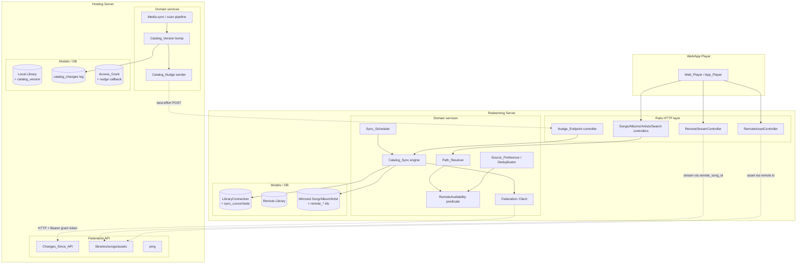
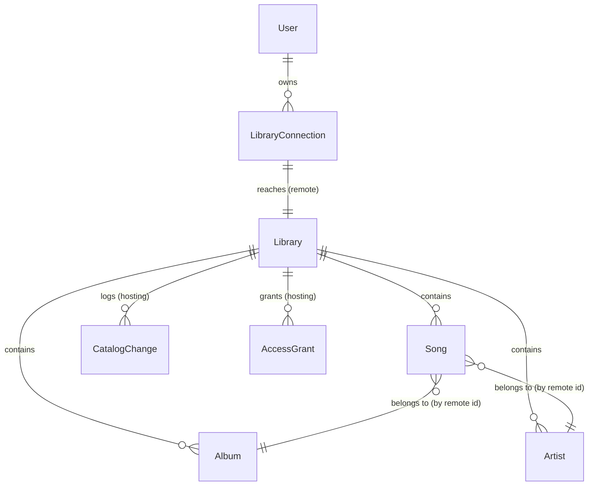

# Design Document

## Overview

This feature completes the last mile of the shipped **multi-server-library-sharing** platform. Today a `Library_Connection` (in `app/models/library_connection.rb`) records how to reach a `Remote_Library` — `server_base_url`, `remote_library_id`, an encrypted `grant_token`, `user_id`, and a `status` of `active｜revoked｜unavailable` — and `Federation::Client` (in `app/models/federation/client.rb`) can browse, stream, fetch assets, confirm a grant, and ping a hosting Server. But the redeeming Server stores **no catalog** for the Remote_Library, so browsing into it returns nothing. `RemoteStreamController` even carries an explicit `ASSUMPTION` in its `remote_song_id` helper: it uses the local `Song#id` as the hosting song id because "there is currently no stored mapping between a local remote-library Song id and the hosting server's song id."

This design adds a **metadata-only catalog mirror with hybrid synchronization** that fills that gap. Two decisions from the requirements shape everything:

1. **The mirror is metadata only.** The redeeming Server materializes a Remote_Library's songs, albums, and artists as local rows — names, durations, track/disc numbers, associations, and the stable hosting-side identifiers — but stores **no audio bytes and no artwork bytes** (Req 1.4). Audio and artwork continue to stream and proxy **live** at request time through the existing Federation API and `RemoteStreamController`. The mirror is a browsable index plus the hosting-side id needed to stream.

2. **Synchronization is hybrid: a pull backbone with a best-effort push nudge.** A Full_Sync runs when a Library_Connection is first established; thereafter the redeeming Server periodically pulls "changes since a cursor." The hosting Server additionally fires a best-effort `Catalog_Nudge` so redeemers pull immediately — but because a redeemer may be behind NAT, the nudge is only an optimization and the next scheduled pull always reconciles. **Correctness never depends on nudge delivery** (Req 6.3, 6.4).

### Design Principles

- **Reuse the shipped seams, don't rebuild them.** `Path_Resolver` already classifies a Song in a `remote?` library as `stream_source: remote`; `RemoteStreamController` already proxies bytes through a Song's `library.library_connection`; `Library#before_destroy` already cascades content cleanup with the exact "remove album/artist iff no song remains" semantics deletion propagation needs. The mirror is built to slot into these seams, not to introduce a parallel content model.
- **The mirror is just a Remote_Library's content.** Mirrored_Songs/Albums/Artists are ordinary `Song`/`Album`/`Artist` rows whose `library` is a `kind: remote` Library. This is what `Path_Resolver` and `RemoteStreamController` already assume. The only new data is the stored hosting-side id per row (`remote_song_id` and friends), which resolves the standing `RemoteStreamController` ASSUMPTION.
- **Local-only serving is preserved by construction.** DAAP/RSP already serve only `Library.local` content, and the Federation API already serves only `Library.local.find_by(...)`. Because every mirrored row lives in a `kind: remote` library, it is excluded from both **without new filtering** — the design's job is to *not* break that (Req 11.1, 11.4).
- **Pure logic is separated from protocol I/O.** Catalog-version bumping, change-log delta computation, the changes-since authorization predicate, the apply/converge/idempotence logic of a sync, teardown scoping, the failure-state machine, and the availability predicate are pure and property-tested with `rantly`. The HTTP round trips (Changes_Since_API, nudge delivery, live stream/asset proxy) are integration/smoke tested, consistent with the reference design.
- **Do no harm to 843 passing tests.** New columns are additive and nullable; new validations are conditioned on `remote?` libraries so local content is untouched; the mirror reuses existing scopes. The design MUST NOT break the DAAP/RSP local-only rule nor the existing 843 passing tests.

### Notable Technical Risks

- **Change-log retention vs. full-sync signalling (Low/Medium).** Serving incremental deltas requires the hosting Server to retain a per-library change log. If the log is pruned below a redeemer's cursor, the host must signal `full_sync_required` rather than return a partial delta (Req 3.7). The design keeps this a simple, explicit boundary rather than trying to reconstruct arbitrarily old deltas.
- **NAT traversal for nudges (Medium).** A hosting Server cannot assume it can reach a redeemer. Nudges are fire-and-forget with no indefinite retry (Req 6.3); the redeemer registers a callback URL and a `nudge_token` at redemption, and delivery failure is non-fatal. This is why the pull backbone is the source of correctness.
- **Mid-sync failure atomicity (Medium).** A sync that fails partway must never leave a partially-updated mirror with an advanced cursor (Req 10.3). The design applies each sync's changes and its cursor advance in a single database transaction so a failure rolls the whole apply back.
- **Reusing content tables for byte-less rows (Medium).** `Song` currently validates presence of `file_path`, `file_path_hash`, and `md5_hash`. Mirrored songs have no local file. The design relaxes these validations conditionally for `remote?`-library songs; this is the main touch-point against existing model tests and is called out in Data Models.

## Architecture

### High-Level Component Map



### Request Flow: Browsing a Mirrored Library (no live round-trip)

1. A browse/search/list controller scopes results to the User's selected library exactly as today (`in_library`). When that library is a `kind: remote` Library, the rows returned are Mirrored_Songs/Albums/Artists already materialized locally.
2. No `Federation::Client` call is made to satisfy the browse (Req 1.7). Live Federation calls remain only for synchronization, live playback, and artwork proxying.
3. `Path_Resolver` classifies each Mirrored_Song as `remote` and, when the connection is active, emits the same-origin `/stream/remote/:song_id` path (Req 7.5) — unchanged from the shipped resolver.

### Sync Flow: Pull Backbone + Best-Effort Nudge

```mermaid
sequenceDiagram
    participant H as Hosting Server
    participant N as Redeemer Nudge_Endpoint
    participant Q as Redeemer SolidQueue
    participant S as Catalog_Sync job
    participant R as Redeemer DB (mirror)

    Note over H: Catalog changes (Media.sync add/remove/modify)
    H->>H: bump catalog_version, append catalog_changes rows
    H-->>N: POST nudge (best-effort, may fail on NAT)
    N->>Q: enqueue immediate Incremental_Sync (if known connection)
    Note over Q: Sync_Scheduler also enqueues every Poll_Interval
    Q->>+S: run Incremental_Sync(connection)
    S->>H: GET /federation/libraries/:id/changes?cursor&page (Bearer grant)
    alt authorized & servable incrementally
        H-->>S: { changes:[upsert|deletion...], catalog_version, full_sync_required:false }
        S->>R: BEGIN TX: apply upserts+deletions, advance sync_cursor
        S->>R: COMMIT; sync_state=fresh, last_synced_at=now
    else full_sync_required
        H-->>S: { full_sync_required:true, catalog_version }
        S->>H: browse songs/albums/artists (paged)
        S->>R: BEGIN TX: replace mirror, adopt catalog_version
    else 401/403 Unauthorized
        H-->>S: 403
        S->>R: teardown mirror / mark unavailable; sync_state=unavailable
    else unreachable / timeout
        H-->>S: (no response within CONTENT_TIMEOUT)
        S->>R: keep mirror + cursor; sync_state=stale
    end
    S-->>-Q: done
```

### Cross-Server HTTP API Contract (Federation API additions)

The existing contract from the shipped feature is extended with one new hosting endpoint and one new redeemer-received endpoint. All hosting calls use HTTPS and a Bearer token equal to the `Access_Grant` secret token, under the `/federation` namespace, and reuse `Federation::Client`'s `CONTENT_TIMEOUT` (10s) budget.

| Purpose | Method & Path | Direction | Auth | Request | Response |
|---|---|---|---|---|---|
| **Changes since cursor (Req 3.2)** | `GET /federation/libraries/:id/changes` | redeemer → host | Bearer grant token | `?cursor=<int>&page=<int>` | `200 { catalog_version, full_sync_required, changes: [ {change_type:"upsert", item_type, id, metadata, associations} \| {change_type:"deletion", item_type, id} ] }` or `403` |
| **Catalog nudge (Req 6.1, 6.2)** | `POST /nudges` | host → redeemer | `nudge_token` (opaque, per-connection) | `{ nudge_token }` | `204` (accepted or ignored — never leaks whether a connection exists) |
| Register nudge callback (Req 6.1, extension) | piggy-backed on `POST /federation/grants/confirm` | redeemer → host | Bearer grant token | `{ library_id, nudge_callback_url, nudge_token }` | `200 { library:{id,name}, valid:true }` |

Existing endpoints (`grants/confirm`, `libraries/:id/{songs,albums,artists}`, `songs/:id/stream`, `{albums,artists}/:id/asset`, `ping`) are unchanged and reused as-is; the mirror sync consumes `changes`, and live playback/artwork reuse `songs/:id/stream` and `:id/asset`.

**Changes_Since authorization.** The Changes_Since_API authorizes exactly like the other federation endpoints via `Federation::BaseController#authorize_federation!` → `LibraryAccess#authorize_grant!`: it digests the presented token, requires a matching `Access_Grant` that is `usable?` (active and not expired) and whose `library_id` equals the requested library, and returns `403` otherwise (Req 3.3). No change is returned until authorization passes. A `403` here is the redeemer's teardown signal (Req 9.1, 9.4) because `Federation::Client` maps `401/403` to `Unauthorized`.

**Nudge authentication and NAT-safety.** The redeemer generates a random `nudge_token` and its own `nudge_callback_url` (its base URL + `/nudges`) at redemption and passes them to the host during `confirm_grant`; the host stores them on the `Access_Grant`. When a library's catalog changes, the host POSTs `{ nudge_token }` to each active grant's callback URL, fire-and-forget with a short timeout and **no indefinite retry** (Req 6.3). The redeemer looks up the `LibraryConnection` by `nudge_token`; a hit schedules an immediate Incremental_Sync, a miss is ignored and still returns `204` so the endpoint reveals nothing about which connections exist (Req 6.5).

## Components and Interfaces

### Hosting side — Catalog_Version and the change log

`Catalog_Version` is a per-`Library` monotonically non-decreasing integer, stored as `libraries.catalog_version` (default 0). It is bumped, and a `catalog_changes` row is appended, on **every** catalog change that originates in the scan pipeline — `Media.sync(:added)`, `Media.sync(:modified)`, `Media.sync(:removed)`, and the album/artist orphan cleanup in `Media.clean_up`.

```ruby
module CatalogVersioning
  # Called from Media.sync / Media.clean_up after a content change commits.
  # Bumps the owning local library's catalog_version and records one
  # CatalogChange row per affected item, stamped with the new version.
  def self.record_upsert(item)   # song/album/artist created or metadata-updated
  def self.record_deletion(type:, remote_id:, library:) # item removed
end
```

- **Bump hook.** `Media.sync` is the single origin of hosting-side catalog change (add/modified/removed), and `Media.clean_up` is where orphaned albums/artists are destroyed. Both are instrumented to call `CatalogVersioning` so the version and the log stay in lock-step with the catalog. Because `Media.sync` already resolves a `library_id`, the bump is naturally per-Local_Library.
- **Change log (`catalog_changes`).** Each row is `{ library_id, version, item_type (song|album|artist), item_id (hosting-side id), change_type (upsert|deletion) }`. `version` equals the library's `catalog_version` immediately after the bump. Upserts store only the id/type — current metadata is read live from the `Song`/`Album`/`Artist` row at serve time (a deletion, whose row is gone, is fully described by id+type, which is why deletions carry no metadata; Req 3.5).
- **Serving `changes_since(cursor)`.** Return `catalog_changes` where `version > cursor`, ordered by `version` ascending, paginated; hydrate each upsert from its live row (Req 3.4) and pass deletions through by id+type (Req 3.5). The adopted `catalog_version` returned is the library's current version. When `cursor >= catalog_version`, return an empty `changes` set with the current version (Req 3.6).
- **Full-sync-required (Req 3.7).** The log is retained down to a floor version (a configurable retention window; oldest rows may be compacted). If `cursor` is below the oldest retained `version` (the host can no longer serve that cursor incrementally), the response sets `full_sync_required: true` and returns no partial change set. First-ever sync (`cursor = 0`) with a non-empty catalog is served incrementally as a stream of upserts, or as full-sync-required — either converges (Req 8.3).

### Hosting side — Federation::ChangesController

A new `Federation::ChangesController < Federation::BaseController` action reuses the base controller's `authorize_federation!(params[:library_id])` (grant digest match + `usable?` + library reference — Req 3.3) and then serves the change page. It reuses the existing pagination (`pagy`) and the local jbuilder shapes for upsert metadata so the mirror receives the same field set local browsing produces.

### Hosting side — Catalog_Nudge sender

```ruby
class CatalogNudgeJob < ApplicationJob   # SolidQueue, best-effort
  # For a changed local library, POST { nudge_token } to each ACTIVE, non-revoked
  # Access_Grant's registered nudge_callback_url. Fire-and-forget: short timeout,
  # no retry on failure; a NAT-unreachable redeemer is a non-fatal miss.
  def perform(library_id); end
end
```

- Enqueued by the `CatalogVersioning` bump hook after the change commits (Req 6.1).
- Iterates `AccessGrant.active` for the library that have a `nudge_callback_url`. Delivery uses a short timeout and does **not** retry indefinitely; a failure leaves the Catalog and the Access_Grant unchanged (Req 6.3).
- Never required for correctness: the redeemer's scheduled pull reconciles regardless (Req 6.4).

### Redeeming side — Federation::Client#changes_since

One method is added to the existing client, reusing `CONTENT_TIMEOUT` and the existing domain errors (`Unreachable`, `Timeout`, `Unauthorized`, `Error`) so the sync engine handles the same small exception set as the stream proxy:

```ruby
# Fetch a page of catalog changes after `cursor` for a remote library (Req 4.2).
# Uses the 10s CONTENT_TIMEOUT (Req 10.5). Raises Unauthorized on 401/403 (the
# teardown signal, Req 9.4), Unreachable/Timeout on transport failure (the
# stale signal, Req 10.1).
def changes_since(library_id, cursor, page = 1)
  response = request(
    :get,
    "#{NAMESPACE}/libraries/#{library_id}/changes",
    timeout: CONTENT_TIMEOUT,
    query: { cursor: cursor, page: page }
  )
  parse_json(response)
end
```

### Redeeming side — Catalog_Sync engine

```ruby
module CatalogSync
  # Replace the entire mirror for a connection with the host's current catalog
  # and adopt its catalog_version as the sync_cursor (Req 1.1, 5.3, 8.1).
  def self.full_sync(connection)

  # Request changes after the recorded sync_cursor and apply them, then advance
  # the cursor to the returned catalog_version (Req 4.2, 4.3). Falls back to
  # full_sync when the host signals full_sync_required (Req 4.4).
  def self.incremental_sync(connection)

  # Pure apply step (property-tested): given the current mirror and an ordered
  # change set, produce the next mirror. Upserts create/update by
  # (library, remote_id); deletions remove by (library, remote_id) and drop
  # orphaned albums/artists iff no mirrored song remains (Req 5.1, 5.2, 8.2).
  def self.apply(connection, changes)
end
```

- **Atomicity (Req 10.3).** Each `full_sync`/`incremental_sync` wraps its apply **and** its `sync_cursor` advance in a single `ActiveRecord::Base.transaction`. A failure partway rolls the whole apply back, so the cursor never advances over a partial mirror.
- **Upsert apply.** For each upsert, `create_or_find_by!` the Mirrored_Artist and Mirrored_Album in the remote Library keyed on `(library_id, remote_artist_id)` / `(library_id, remote_album_id)`, then upsert the Mirrored_Song keyed on `(library_id, remote_song_id)`, wiring `album`/`artist` associations to the mirrored rows carrying the corresponding hosting-side ids (Req 2.1, 2.5). Idempotent by construction — re-applying the same upsert updates the same row to the same values (Req 8.2).
- **Deletion apply.** Remove the Mirrored_Song by `(library_id, remote_song_id)`; then reuse the exact orphan-cleanup semantics already in `Media.clean_up` (album/artist removed iff no song remains) scoped to the remote Library (Req 5.2). A per-item deletion failure is tolerated: the item is left to be removed on a later sync (Req 5.4), consistent with `Media.clean_up`'s scoping.
- **Full sync as replace-and-converge.** `full_sync` fetches the host catalog via the existing `browse` calls (songs/albums/artists, paged), rebuilds the mirror to exactly that set by hosting-side id (removing anything absent), and adopts the current `catalog_version` (Req 5.3, 8.1, 8.4). Full and incremental paths converge to identical mirrors at the same version (Req 8.3).

### Redeeming side — CatalogSyncJob and Sync_Scheduler

```ruby
class CatalogSyncJob < ApplicationJob    # SolidQueue
  # mode: :incremental (default) or :full
  def perform(library_connection_id, mode: :incremental); end
end
```

- **Sync_Scheduler.** A SolidQueue **recurring** task runs every `Poll_Interval` and enqueues an Incremental_Sync `CatalogSyncJob` for each `LibraryConnection.active` (Req 4.1). `Poll_Interval` is configurable (a `BlackCandy.config`/`Setting` value) with a defined default (e.g. 15 minutes) applied when unset (Req 4.5).
- **First-connection Full_Sync.** `InviteManager#find_or_create_connection` (the cross-server redemption path) enqueues a `CatalogSyncJob(connection.id, mode: :full)` when it creates a **new** connection, so the mirror is materialized on establishment (Req 1.1). Re-redemption that reuses an existing connection does not re-trigger a full sync (idempotent redemption is preserved).
- **Nudge-triggered sync.** The Nudge_Endpoint enqueues an immediate Incremental_Sync (Req 6.2).

### Redeeming side — Nudge_Endpoint (NudgesController)

```ruby
class NudgesController < ActionController::API
  # POST /nudges  { nudge_token }
  # Token-authenticated server-to-server; skips session auth and CSRF like the
  # federation endpoints. Looks up the LibraryConnection by nudge_token.
  def create
    connection = LibraryConnection.find_by(nudge_token: params[:nudge_token])
    CatalogSyncJob.perform_later(connection.id, mode: :incremental) if connection&.active?
    head :no_content   # ignore unknown/inactive connections without disclosure (Req 6.5)
  end
end
```

- Accepts a nudge only for a `LibraryConnection` the redeemer holds; an unknown `nudge_token` is ignored and still returns `204` (Req 6.5).
- Scheduling is idempotent from the mirror's perspective: whether or not any nudge arrives, the scheduled pull converges (Req 6.4).

### Redeeming side — RemoteAvailability predicate

A single predicate is the **shared source of truth** for "is this mirrored song currently reachable," used by both `Path_Resolver` and `Source_Preference` so the two can never disagree (Req 11.3):

```ruby
module RemoteAvailability
  # A Mirrored_Song is available iff its Remote_Library's Library_Connection
  # exists and is active. Local songs are always available.
  def self.available?(song)
    library = song.library
    return true unless library&.remote?
    (conn = library.library_connection).present? && conn.active?
  end
end
```

`Path_Resolver#remote_connection_resolvable?` already encodes exactly this (`connection.present? && connection.active?`); this extracts it so `SourcePreference.select`'s availability filter calls the same predicate. Strict consistency (unavailable for both selection and resolution together) then holds by construction.

### Redeeming side — live playback and artwork wiring

- **Streaming (Req 7.2).** `RemoteStreamController#remote_song_id` stops returning `song.id` and returns the stored `song.remote_song_id` (the hosting-side id). This is the exact single-point translation the controller's ASSUMPTION comment anticipated. Everything else in the proxy (loading the connection via `song.library.library_connection`, the 10s timeout, range forwarding, `render_unavailable`) is unchanged. If the host is unavailable at playback, the proxy fails immediately with `503` and never falls back to stored bytes — there are none (Req 7.3).
- **Artwork (Req 7.4).** `Path_Resolver#resolve_asset` already emits the same-origin `/asset/remote/:type/:id` path for remote records. A new `RemoteAssetController` (mirroring `RemoteStreamController`) loads the Mirrored_Album/Mirrored_Artist, reads its `remote_album_id`/`remote_artist_id`, and proxies the bytes live via `Federation::Client#asset(remote_library_id, type, remote_id, variant:)`. No artwork bytes are stored (Req 1.4).
- **Classification (Req 7.5).** Because mirrored rows live in `kind: remote` libraries, `Path_Resolver#remote?` already classifies them `remote` and produces the remote-stream proxy path — no resolver change needed.

## Data Models

### Entity-Relationship Overview



### Redeeming side — reuse content tables, add hosting-side ids

**Decision: reuse the existing `songs` / `albums` / `artists` tables; do not create separate mirror tables.**

Rationale, weighed against the alternative of dedicated `mirrored_*` tables:

- **The shipped architecture already models remote content as `Song`/`Album`/`Artist` rows in a `kind: remote` Library.** `Path_Resolver#remote?` keys on `record.library.remote?`; `RemoteStreamController#remote_connection_for` keys on `song.library.remote?` then `library.library_connection`; `Library#before_destroy` cascades content cleanup for any library. Separate mirror tables would require re-implementing resolution, browsing, search, deduplication, source-preference, and teardown for a second entity type — high risk to the 843 tests and to R7.5/R11.3 consistency.
- **Local-only serving is preserved for free.** DAAP/RSP and the Federation API already scope to `Library.local`. Remote-library rows are excluded without new filters (Req 11.1, 11.4). Separate tables would *also* achieve this but at the cost above.
- **Identity and scoping already fit.** Content is already library-scoped (`in_library`, `(library_id, …)` unique indexes). A remote Library has exactly one `library_connection`, so scoping by `library_id` is equivalent to scoping by connection — satisfying "identify each mirrored item by (Library_Connection, hosting-side id)" (Req 2.2) and "two connections stay separate" (Req 2.4) directly.

Additive, backward-compatible schema changes:

**`songs` / `albums` / `artists`** (modified — additive)

| Column | Type | Notes |
|---|---|---|
| `remote_song_id` (songs) | integer, null | hosting-side id; null for local songs (Req 7.1) |
| `remote_album_id` (albums) | integer, null | hosting-side id; null for local albums |
| `remote_artist_id` (artists) | integer, null | hosting-side id; null for local artists |

- **New unique indexes** on `(library_id, remote_song_id)`, `(library_id, remote_album_id)`, `(library_id, remote_artist_id)` (partial: `WHERE remote_*_id IS NOT NULL`) enforce the `(Library_Connection, hosting-side id)` identity (Req 2.2) and make upserts idempotent (Req 8.2).
- **Conditional validation relaxation.** `Song` presence validations for `file_path`, `file_path_hash`, `md5_hash` become `if: -> { library&.local? }`. Mirrored songs (remote library) carry none of these — they store no file (Req 1.4). Local songs are unaffected, protecting existing model tests. `name`, `duration`, `tracknum`, `discnum` are the mirrored fields (Req 1.2).
- **No byte columns are added.** No audio blob, no ActiveStorage artwork attachment is created for mirrored rows — artwork is proxied live (Req 1.4, 7.4).
- **Association preservation.** A Mirrored_Song's `album_id`/`artist_id` point at the Mirrored_Album/Mirrored_Artist in the same remote Library that carry the matching `remote_album_id`/`remote_artist_id` (Req 2.1, 2.5).

**`library_connections`** (modified — additive, redeeming side)

| Column | Type | Notes |
|---|---|---|
| `sync_cursor` | integer, default 0 | highest applied Catalog_Version (Req 4.3, 6/Sync_Cursor) |
| `last_synced_at` | datetime, null | last successful Full/Incremental sync (Req 4.6) |
| `sync_state` | string, default `fresh` | `fresh｜stale｜unavailable` (Req 4.6, 9.1, 10.1) |
| `nudge_token` | string, null, unique | opaque per-connection token for the Nudge_Endpoint (Req 6.5) |

`sync_state` is a new enum distinct from the existing `status` (`active｜revoked｜unavailable`). `status` is the connection/grant lifecycle; `sync_state` is the mirror's freshness. `sync_state = unavailable` is set on teardown; `stale` on transient failure; `fresh` on success.

### Hosting side — catalog version and change log

**`libraries`** (modified — additive, hosting side)

| Column | Type | Notes |
|---|---|---|
| `catalog_version` | integer, default 0, null: false | monotonically non-decreasing per local library (Req 3.1) |

**`catalog_changes`** (new — hosting side)

| Column | Type | Notes |
|---|---|---|
| `id` | pk | |
| `library_id` | fk libraries (local) | the changed library |
| `version` | integer, null: false | the `catalog_version` after this change (Req 3.1) |
| `item_type` | string, null: false | `song｜album｜artist` |
| `item_id` | integer, null: false | hosting-side id of the changed item (Req 3.4, 3.5) |
| `change_type` | string, null: false | `upsert｜deletion` |
| `created_at` | datetime | |

Index on `(library_id, version)` serves ordered, paginated `changes_since` queries. A retention floor allows old rows to be compacted; a cursor below the floor triggers `full_sync_required` (Req 3.7).

**`access_grants`** (modified — additive, hosting side)

| Column | Type | Notes |
|---|---|---|
| `nudge_callback_url` | string, null | redeemer's `/nudges` URL, registered at redemption (Req 6.1) |
| `nudge_token` | string, null | the redeemer's opaque token echoed back in the nudge (Req 6.5) |

Both are nullable and best-effort: a grant without a callback simply receives no nudge and relies on the redeemer's scheduled pull (Req 6.4).

### Teardown reuse

No new teardown table or cascade is needed. Deleting a remote `Library` (on connection deletion) already runs `Library#destroy_scoped_content`, removing its songs then album/artist orphans scoped to that library (Req 9.3). Marking a mirror unavailable is a `sync_state`/`status` update plus browse-scope exclusion (below); other connections' remote libraries are untouched because everything is `library_id`-scoped (Req 9.5).

### Browse-scope exclusion for inactive connections

Browsing, searching, and listing must exclude a remote Library whose connection is not `active` (Req 9.2, 11.3). The authorized-libraries helper that already selects "local owned + active remote connections" is the single place this is enforced: a remote Library is browsable only while `library.library_connection&.active?`. This is the same predicate as `RemoteAvailability`, keeping browse visibility, path resolution, and source selection consistent.


## Correctness Properties

*A property is a characteristic or behavior that should hold true across all valid executions of a system — essentially, a formal statement about what the system should do. Properties serve as the bridge between human-readable specifications and machine-verifiable correctness guarantees.*

These properties apply to the **pure logic** of this feature: catalog-version bumping and the change-log delta computation, the changes-since authorization predicate, the apply/converge/idempotence logic of a synchronization, delete propagation and orphan cleanup, mirror scoping and association preservation, the metadata-only invariant, teardown scoping, the failure-state machine, the shared availability predicate, local-only exclusion, remote classification, and nudge-to-connection mapping. They do **not** apply to protocol/network I/O — the Changes_Since_API HTTP round trip, nudge delivery and its no-retry behavior, the live audio and artwork proxies, scheduler timing, and timeout-budget reuse — which are covered by integration and smoke tests (see Testing Strategy). The set below is consolidated from the prework, with redundant properties merged.

### Property 1: Catalog_Version is monotonically non-decreasing and strictly increases on change

*For any* Local_Library and *any* sequence of catalog changes (additions, metadata updates, deletions) applied through the scan pipeline, the Library's Catalog_Version SHALL never decrease across the sequence and SHALL strictly increase on every change.

**Validates: Requirements 3.1**

### Property 2: Changes-since returns exactly the post-cursor changes in order, and is empty at or beyond the current version

*For any* change log for a Local_Library and *any* Sync_Cursor, the Changes_Since_API SHALL return exactly the Catalog_Changes whose version is greater than the cursor, in non-decreasing version order, each upsert carrying its hosting-side id, type, metadata, and associations and each deletion carrying its hosting-side id and type, together with the current Catalog_Version to adopt; when the cursor is greater than or equal to the current Catalog_Version the returned change set SHALL be empty; when the cursor is older than the log can serve incrementally the response SHALL signal that a Full_Sync is required rather than returning a partial change set.

**Validates: Requirements 3.2, 3.4, 3.5, 3.6, 3.7**

### Property 3: Changes-since requires an authorized, active, non-revoked, non-expired grant referencing the library

*For any* presented credential token and *any* set of Access_Grants in arbitrary states, the Changes_Since_API SHALL return Catalog_Changes if and only if the token matches exactly one Access_Grant whose status is active, whose expiration is in the future, and which references the requested Library; in every other case it SHALL reject with an authorization error and return no changes.

**Validates: Requirements 3.3, 9.4**

### Property 4: A successful sync converges the mirror to the host catalog at the adopted version

*For any* Hosting_Server Catalog and *any* starting Catalog_Mirror for a Library_Connection, after a synchronization completes successfully the Catalog_Mirror SHALL contain exactly the items of that Catalog identified by hosting-side identifier — with every song→album and song→artist association preserved, no item absent from that Catalog remaining, and no extra item — and the Library_Connection's Sync_Cursor SHALL equal the adopted Catalog_Version with Sync_State set to `fresh` and Last_Synced_At recorded.

**Validates: Requirements 1.6, 2.5, 4.3, 4.6, 5.3, 8.1, 8.4, 10.4**

### Property 5: Applying the same change set is idempotent

*For any* Catalog_Mirror and *any* set of Catalog_Changes, applying that set more than once SHALL yield a Catalog_Mirror identical to the one produced by applying it exactly once.

**Validates: Requirements 8.2, 2.2**

### Property 6: Full and incremental syncs to the same version converge to identical mirrors

*For any* Hosting_Server Catalog reached by a Full_Sync versus by a series of Incremental_Syncs that each advance a Library_Connection to the same Catalog_Version, the resulting Catalog_Mirrors SHALL be identical.

**Validates: Requirements 8.3, 4.4**

### Property 7: Deletions propagate and orphaned albums/artists are cleaned up exactly when unreferenced

*For any* Catalog_Mirror and *any* deletion Catalog_Change, applying it SHALL remove the Mirrored_Song, Mirrored_Album, or Mirrored_Artist identified by the pairing of the Library_Connection and the item's hosting-side identifier, and SHALL remove a Mirrored_Album or Mirrored_Artist if and only if no Mirrored_Song remains associated with it in that same Catalog_Mirror afterward.

**Validates: Requirements 5.1, 5.2**

### Property 8: Mirrored items preserve associations and stay scoped per connection

*For any* materialized Catalog_Mirror, each Mirrored_Song SHALL be associated with the Mirrored_Album and Mirrored_Artist in the same Remote_Library that carry the corresponding hosting-side identifiers; every mirrored item SHALL be scoped to exactly one Remote_Library; and *for any* two distinct Library_Connections that mirror content sharing the same hosting-side identifier value, neither connection's mirrored items SHALL be attributed to the other.

**Validates: Requirements 1.2, 1.3, 1.5, 2.1, 2.2, 2.3, 2.4**

### Property 9: The mirror stores no audio or artwork bytes

*For any* materialized Catalog_Mirror, no Mirrored_Song SHALL store audio byte content and no Mirrored_Album or Mirrored_Artist SHALL store artwork byte content.

**Validates: Requirements 1.4**

### Property 10: A failed sync retains the mirror and cursor and marks it stale

*For any* synchronization that fails because the Hosting_Server is unreachable or exceeds the content timeout, or that fails partway through applying Catalog_Changes, the Catalog_Mirror SHALL be left in the state it held before that synchronization began, the Sync_Cursor SHALL be unchanged, and the Sync_State SHALL be set to `stale`; in no case SHALL the Catalog_Mirror be left partially updated with an advanced Sync_Cursor.

**Validates: Requirements 10.1, 10.3**

### Property 11: Teardown removes or hides only the affected connection's mirror

*For any* set of Library_Connections with Catalog_Mirrors, tearing down one connection — because a synchronization was rejected with an authorization error (mirror removed or marked unavailable, Sync_State `unavailable`), because its status became revoked or unavailable (no longer served for browsing, searching, or listing), or because the connection was deleted (mirror removed in full) — SHALL leave every other Library_Connection's Catalog_Mirror unchanged and still browsable.

**Validates: Requirements 9.1, 9.2, 9.3, 9.5**

### Property 12: Mirrored-song availability is consistent across selection and resolution

*For any* Mirrored_Song and *any* state of its Library_Connection, the Redeeming_Server SHALL treat that Mirrored_Song as available for Source_Preference selection if and only if it is resolvable by Path_Resolver, and while the Library_Connection is not active it SHALL be unavailable for both together; a Mirrored_Song SHALL never be available for one while unavailable for the other.

**Validates: Requirements 11.2, 11.3**

### Property 13: DAAP, RSP, and the server's own Federation API expose no mirrored content

*For any* library and authorization configuration, the content served over the DAAP_Service or the RSP_Service SHALL be a subset of the current Server's Local_Library content and SHALL contain no Mirrored_Song, Mirrored_Album, or Mirrored_Artist; and the current Server's own Federation API endpoints SHALL likewise expose no mirrored content.

**Validates: Requirements 11.1, 11.4**

### Property 14: Mirrored songs classify as remote and resolve through the same-origin proxy keyed on the hosting id

*For any* Mirrored_Song, Path_Resolver SHALL classify its Stream_Source as `remote`, and when its Library_Connection is active SHALL produce a Resolved_Stream_Path through the same-origin remote-stream proxy; the audio fetch for that Mirrored_Song SHALL be keyed on the pairing of the Library_Connection and the stored Remote_Song_Id.

**Validates: Requirements 7.1, 7.5**

### Property 15: A catalog nudge schedules a sync exactly when it maps to a held connection

*For any* received Catalog_Nudge, the Redeeming_Server SHALL schedule an immediate Incremental_Sync if and only if the nudge maps to a Library_Connection the Redeeming_Server holds, and SHALL ignore a nudge that does not correspond to a known Library_Connection; convergence of the Catalog_Mirror through the next scheduled Incremental_Sync SHALL hold whether or not any nudge was received.

**Validates: Requirements 6.2, 6.4, 6.5**

## Error Handling

Errors reuse the existing `Federation::Client` domain exceptions (`Unreachable`, `Timeout`, `Unauthorized`, `Error`) and the app's exception model. The redeeming sync engine maps this small set of exceptions onto the two distinct outcomes the requirements demand — **stale** (retain everything) versus **teardown** (remove/hide) — and never conflates them.

| Condition | Requirement | Handling |
|---|---|---|
| Changes-since request presents no / unknown / revoked / expired grant, or one not referencing the library | 3.3, 9.4 | Hosting `authorize_federation!` raises `BlackCandy::Forbidden` → `403`; no changes returned |
| Sync receives `403` (`Federation::Client::Unauthorized`) | 9.1, 9.4 | Teardown: remove or mark the mirror unavailable, set `sync_state: unavailable`; other connections untouched |
| Hosting Server unreachable or exceeds `CONTENT_TIMEOUT` during sync | 10.1, 10.2, 10.5 | Retain last-known mirror, leave `sync_cursor` unchanged, set `sync_state: stale`; keep serving and surface staleness |
| Sync fails partway through applying changes | 10.3 | Whole apply + cursor advance run in one transaction and roll back; mirror and cursor unchanged, `sync_state: stale` |
| Cursor older than the retained change log | 3.7 | Host returns `full_sync_required: true`; redeemer runs a Full_Sync instead of a partial apply (Req 4.4) |
| Per-item deletion fails (DB error / concurrency) during sync | 5.4 | Tolerated: sync continues, item left in the mirror to be removed on a later sync |
| Host unavailable when playing a Mirrored_Song | 7.3 | `RemoteStreamController` returns `503 RemoteLibraryUnavailable`; no stored-bytes fallback (there are none) |
| Host unavailable when viewing mirrored artwork | 7.4 | `RemoteAssetController` surfaces the asset as unavailable; no stored bytes |
| Nudge callback unreachable (NAT) | 6.3 | `CatalogNudgeJob` fails the delivery without indefinite retry; Catalog and Access_Grant unchanged |
| Nudge received for unknown / inactive `nudge_token` | 6.5 | `NudgesController` ignores it and returns `204`, disclosing nothing |
| Browsing a connection whose status is not active | 9.2, 11.3 | Excluded from authorized libraries; not served for browse/search/list, and unavailable for both selection and resolution |

## Testing Strategy

### Dual Approach

- **Property-based tests** verify the 15 universal properties above across many generated inputs. The pure logic (version bumping, change-log delta computation, the changes-since authorization predicate, the sync apply/converge/idempotence engine, delete/orphan cleanup, scope/association preservation, the failure-state machine, the availability predicate, local-only exclusion, remote classification, and nudge mapping) is exercised without network I/O.
- **Unit / example tests** cover concrete branches and configuration: the scheduler enqueuing a job per active connection (4.1), incremental sync passing the recorded cursor (4.2), the full-sync-required branch (4.4), the Poll_Interval default (4.5), per-item deletion-failure tolerance (5.4), stale-still-served-and-flagged (10.2), first-connection full-sync enqueue on redemption (1.1), and browsing a mirror issuing zero Federation calls (1.7).
- **Integration / smoke tests** cover the fallible, I/O-bound, and protocol paths that are NOT suitable for PBT.

### Property-Based Testing

- Library: **`rspec` + `rantly`**, matching the reference design's choice and the existing test setup. Do NOT hand-roll generators or a property runner.
- Each property test runs a **minimum of 100 iterations**.
- Each property test is tagged with a comment referencing its design property, in the format:
  `# Feature: remote-library-mirror-sync, Property {number}: {property_text}`
- Each of the 15 properties is implemented by a **single** property-based test with a purpose-built generator: random host catalogs (songs across albums/artists with shared hosting ids), random change sequences (interleaved upserts/deletions), random cursors (including `>=` current version and below the retention floor for Property 2), grant sets in mixed states (Property 3), multi-connection datasets sharing hosting ids (Property 8), connection states across `active/revoked/unavailable/stale` (Properties 11, 12), and arbitrary nudge tokens (Property 15).
- Generators fold in edge cases: empty catalogs, catalogs with orphan-producing deletions (Property 7), re-applied change sets (Property 5), and mid-apply failure injection for the atomicity half of Property 10.

### Integration & Smoke Tests (NOT property-based)

- **Changes_Since_API round trip** (Req 3.2 endpoint): 1–3 examples against a stubbed hosting Server (`WebMock` or a spun-up test server) verifying the paged change response shape, the empty-set-at-current-version case, and the `403` authorization rejection surfacing as `Federation::Client::Unauthorized`.
- **Catalog nudge delivery** (Req 6.1, 6.3): integration tests asserting a change enqueues nudges to registered callbacks, and that an unreachable callback fails without a retry storm and leaves Catalog and Access_Grant unchanged.
- **Live audio proxy** (Req 7.2, 7.3): integration tests of `RemoteStreamController` proxying via the stored `remote_song_id`, forwarding range headers, and returning `503` with no fallback when the host is unavailable.
- **Live artwork proxy** (Req 7.4): integration test of `RemoteAssetController` proxying via the stored `remote_album_id`/`remote_artist_id`.
- **Scheduler timing** (Req 4.1, 4.5): example/integration that the recurring Sync_Scheduler enqueues an Incremental_Sync per active connection at the configured Poll_Interval and applies the default when unset.
- **Timeout budget** (Req 10.5): example asserting `changes_since` uses `CONTENT_TIMEOUT`.

### Verification Notes

The design deliberately concentrates automatically-verifiable correctness in the pure sync engine (Properties 4–12) so that the protocol adapters (`Federation::ChangesController`, `CatalogNudgeJob`, `RemoteStreamController`, `RemoteAssetController`) stay thin translators whose failures are contained and surfaced as the errors above. The design MUST NOT break the DAAP/RSP local-only rule (Property 13) nor the existing 843 passing tests; the new columns are additive and nullable and the relaxed `Song` file-column validations are conditioned on `local?` libraries, so existing local content and its tests are unaffected.

## Phased Delivery Plan

Each phase is independently shippable and leaves the system working. Tasks should be generated to follow this phasing.

### Phase 1 — Hosting-side catalog versioning and changes-since
**Requirements: 3.** **Properties: 1, 2, 3.**
- `libraries.catalog_version` column; `catalog_changes` log table.
- `CatalogVersioning` bump hook wired into `Media.sync` (added/removed/modified) and `Media.clean_up` orphan cleanup.
- `Federation::ChangesController` reusing `authorize_federation!`, paginated delta serving, empty-at-current-version and full-sync-required signalling.
- Delivers a host that tracks and serves incremental deltas. No redeemer behavior yet.

### Phase 2 — Redeeming-side mirror schema and sync engine
**Requirements: 1, 2, 4, 5, 8, 10.** **Properties: 4, 5, 6, 7, 8, 9, 10.**
- Additive `remote_*_id` columns and partial unique indexes on songs/albums/artists; conditional relaxation of `Song` file-column validations for `remote?` libraries.
- `sync_cursor` / `last_synced_at` / `sync_state` / `nudge_token` on `library_connections`.
- `Federation::Client#changes_since`; `CatalogSync` engine (full/incremental/apply) with transactional atomicity; `CatalogSyncJob` + `Sync_Scheduler`; first-connection Full_Sync hook in `InviteManager#find_or_create_connection`.
- Delivers a browsable, self-reconciling mirror driven purely by the pull backbone.

### Phase 3 — Best-effort nudge
**Requirements: 6.** **Property: 15.**
- Redeemer registers `nudge_callback_url` + `nudge_token` at redemption (extend `confirm_grant`); host stores them on the Access_Grant.
- `CatalogNudgeJob` (fire-and-forget) on the host; `NudgesController` on the redeemer scheduling an immediate Incremental_Sync for a known connection and ignoring unknown ones.
- Purely an optimization on top of Phase 2's converging pull.

### Phase 4 — Live playback, artwork, teardown, and local-only guarantees
**Requirements: 7, 9, 11.** **Properties: 11, 12, 13, 14.**
- `RemoteStreamController#remote_song_id` returns the stored `remote_song_id`; `RemoteAssetController` proxies artwork by hosting id.
- `RemoteAvailability` predicate shared by `Path_Resolver` and `Source_Preference`; browse-scope exclusion of non-active remote connections.
- Teardown paths (auth-error, revoked/unavailable, deletion) reusing `Library#destroy_scoped_content`.
- Confirm DAAP/RSP and own-Federation exclusion of all mirrored content.
- Delivers full listen-and-view over the mirror with correct source-selection, teardown, and local-only serving.
